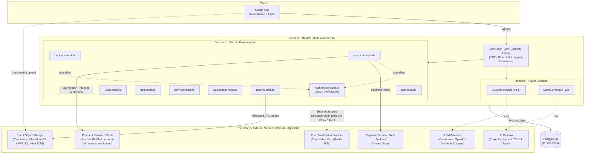
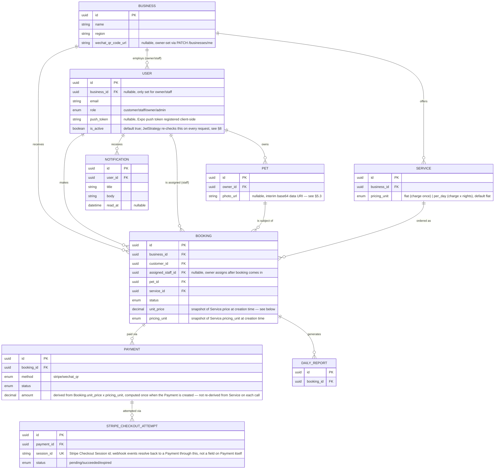
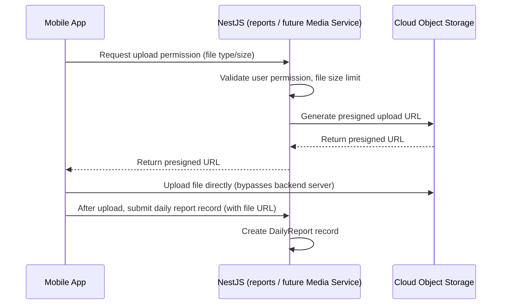
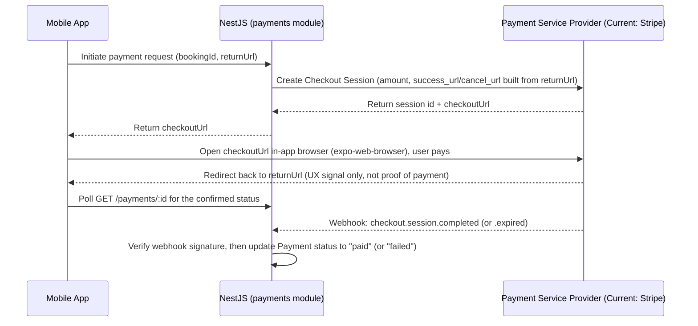
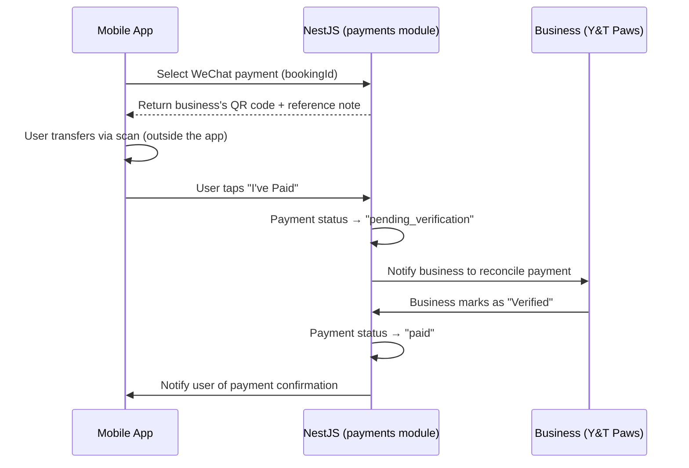
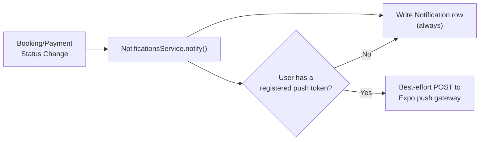
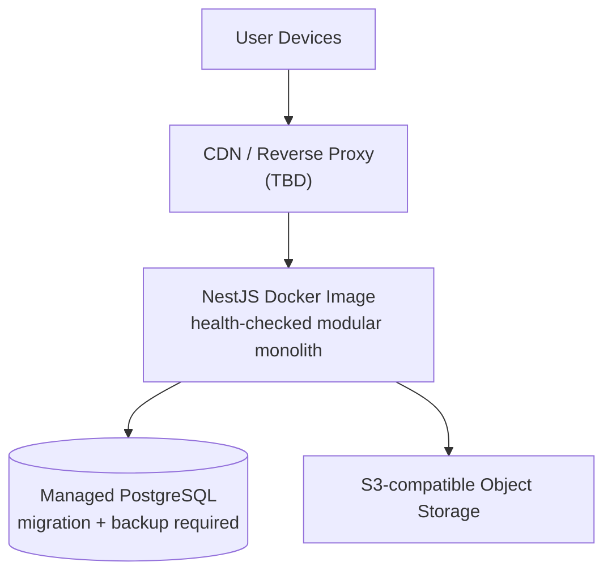

# 03 · System Architecture

**Document Status:** Draft v0.18
**Related Documents:** `01_Project_Overview.md`, `02_Product_Requirements.md`
**Last Updated:** 2026-08-02
**Maintainer:** Xiyun Liu (Product Owner & Developer)

> This document defines PetHome's overall system structure: how components are divided, how they communicate, and where data flows. Detailed database table structures are in `04_Database_Design.md`; detailed API definitions are in `05_API_Design.md`. This document is only responsible for defining the "skeleton."
>
> This document follows a **provider-agnostic** principle: unless there is a clear technical lock-in reason, all third-party service categories (storage, push, AI, cameras, etc.) only describe "what role this category of service plays," without binding to a specific vendor — this avoids having to rewrite the architecture document every time a vendor changes.

---

## 1. Architecture Overview

PetHome v1.0 uses a **Modular Monolith** architecture rather than microservices: a single NestJS application serves as the unified API entry point, internally divided into modules along business boundaries (corresponding to the six functional modules in `02_Product_Requirements.md`), sharing one PostgreSQL database.

**Why a modular monolith instead of microservices:**
- With only one developer (Lily) currently, the operational complexity of microservices (service discovery, cross-service transactions, multiple deployment pipelines) far exceeds what the team size can support
- NestJS's Module mechanism already supports clear boundary separation; if a module (e.g. AI Agent or Camera) genuinely needs to scale independently in the future, it can be extracted from the monolith at relatively low cost
- Aligns with the "Simplicity Before Complexity" design principle from `01_Project_Overview.md`

**Unified entry point (Gateway Layer):** All client requests pass through the same NestJS application first, rather than being spread across multiple independent services. This layer handles JWT authentication, rate limiting, request logging, and validation. This "Gateway Layer" is **not** an independently deployed gateway component (unlike, say, Kong, Nginx, or AWS API Gateway) — it is an architectural concept expressing "a single unified request entry point with cross-cutting concerns handled centrally." Concretely, it is implemented via NestJS's Middleware / Guard / Interceptor mechanisms sitting in front of Controllers and Services:

```
HTTP
  ↓
NestJS Gateway Layer (Middleware / Guard / Interceptor)
  ↓
Controller
  ↓
Service
```



**Diagram notes:**
- Solid lines = connections implemented in Version 1
- Dashed lines = connections only enabled in future versions; currently just reserved in the architecture
- The "Reserved · Future Versions" dashed box = not implemented now, only placeholder in the diagram, so readers can immediately see the gap between the system's eventual shape and current progress

---

## 2. Architecture Principles

The following principles underpin all subsequent design decisions (database, API, module boundaries); when in doubt, defer to these:

| Principle | Description |
|---|---|
| **Single Responsibility** | Each module handles logic within one business boundary only — e.g. `payments` only handles payment flows, not booking business logic |
| **Loose Coupling** | Modules interact through clearly defined interfaces, not by depending directly on each other's internal implementation |
| **High Cohesion** | Functionality within a module is closely related; loosely related functionality should not be crammed into the same module |
| **API First** | Define a clear API contract before implementing internal logic — enables parallel frontend/backend development and easier future replacement of implementations |
| **Cloud Native Ready** | The application is designed stateless, horizontally scalable, and deployable to any mainstream cloud platform without assuming vendor-specific proprietary capabilities |
| **Security by Design** | Security is not an afterthought — it's a default requirement considered at every layer, from database field design to API permission checks |

---

## 3. Component Responsibilities

### 3.1 Client (Mobile App)
- React Native + Expo, both iOS/Android
- Responsible for: UI rendering, local state management, calling backend REST APIs, uploading media files directly to cloud storage (see Section 5)
- Does not connect directly to the database, nor does it call payment provider server-side-key-related APIs directly (payment initiation is proxied by the backend to avoid exposing secret keys on the client)

### 3.2 Backend Modules (NestJS)

| Module | Responsibility | Corresponding PRD Module |
|---|---|---|
| `auth` | Registration (customer, plus the one-time business/owner bootstrap — see §13's ADR), login, JWT issuance/validation/revocation, password reset/change, staff creation/list/activation, and account deletion/anonymization — there is no separate `users` module; account lifecycle is owned by `auth` | Module 1 |
| `pets` | Pet profiles, health records | Module 2 |
| `services` | Display and management of service offerings (boarding / drop-in, etc.) | Module 3 |
| `bookings` | Booking creation, status transitions, cancellation logic, owner-to-staff assignment | Module 3 |
| `businesses` | Business profile fields not set at registration — name, region, WeChat QR code image URL — plus reading them back (`GET /businesses/me`, added 2026-07-31) | Module 4 (supporting) |
| `payments` | Payment initiation, WeChat manual verification flow, payment records | Module 4 |
| `reports` | Creation and viewing of pet daily reports | Module 6 |
| `notifications` | In-app notification records, Expo push token registration, best-effort push delivery — called as a side effect from `bookings`/`payments`, not driven by its own business logic | Module 5 |

> **Evolution direction for `reports`:** Currently `reports` only handles daily pet reports, and this name will remain unchanged. However, future private chat (v1.5) and camera screenshots/recordings (v2) will need the same media upload/storage capability. To avoid each module re-implementing media handling logic independently, the architecture will eventually extract a dedicated **Media Service** underneath `reports`, responsible specifically for interacting with cloud object storage. `reports`, the future Chat module, and the future Camera module would all call this unified Media Service rather than connecting to storage directly:
>
> ```
> Reports / Chat / Camera (future)
>          ↓
>     Media Service
>          ↓
>    Cloud Object Storage
> ```
>
> **Media Service is an architectural abstraction. It does not exist as an independent module in Version 1.** Version 1 does not need to actually extract this service yet — understanding this evolution direction is sufficient for now; the specific extraction timing will be determined in later documents.

### 3.3 Database (PostgreSQL + Prisma)
- A single PostgreSQL instance shared by all modules (typical for a modular monolith)
- Prisma serves as the ORM, handling schema definition, migrations, and type-safe queries
- Detailed table structures are in `04_Database_Design.md`, but the **multi-tenant field design principle** is established in Section 4 below since it affects all tables

---

## 4. Multi-Tenant Architecture Principles (Important)

Per the decision in Section 11 of `01_Project_Overview.md`: Version 1 serves only one business, Y&T Paws, but the data structure needs to be prepared for future multi-business support starting now.

### 4.1 Core Design: `Business` Table + `business_id` Foreign Key



**Key design notes:**
- A new `Business` table is added; in Version 1 it contains only one record (Y&T Paws)
- Core business tables — `Booking`, `Service`, `Payment` (indirectly via Booking) — all carry a `business_id` foreign key
- The `User` table's `business_id` is **nullable**: a regular Customer does not belong to any business (`business_id = null`); only Owner/Staff roles are associated with a specific business
- The benefit of this design: in Version 1, all query logic naturally filters by `business_id = Y&T Paws's ID`, so the code is nearly as simple as "pretending there's no multi-tenancy"; but when a second business is actually onboarded in the future, no schema changes are needed — only the application-layer logic for "how to isolate permissions across multiple business_id values" needs to be handled
- `Booking.assigned_staff_id` (nullable, FK to `User`) lets the Owner assign an incoming booking to one of their staff internally; assignment is required to reference a staff/owner user with the same `business_id` as the booking (see PRD US-03.5/US-03.6). Customers picking their own staff member is out of scope for now — see 4.2
- `Booking.status` only ever advances forward through `PATCH /bookings/:id/status` (owner/admin only): `pending → confirmed → in_progress → completed`, one step at a time; `cancelled` is a separate terminal state reached only via `PATCH /bookings/:id/cancel`. This endpoint isn't tied to a specific PRD user story — it exists because `in_progress` is a precondition for daily reports (US-06.1) and nothing else in the API could ever produce that transition
- `Booking.unit_price`/`pricing_unit` are a snapshot of the `Service`'s values at the moment the booking is created (not a live reference). `Payment.amount` is derived from that snapshot when the Payment row is first created, not from `Service`'s current price — so an owner editing a service's price only affects bookings placed after the edit; it can no longer change what an already-placed (even unpaid) booking owes. All three money fields (`Service.price`, `Booking.unit_price`, `Payment.amount`) are `Decimal(10,2)`, not float, to avoid floating-point rounding on currency
- A `Payment` can have many `StripeCheckoutAttempt` rows, one per Stripe Checkout Session ever created for it. A retry (the customer re-opens the payment screen) gets its own new session rather than overwriting a "current session" field on the Payment — Stripe Sessions can't be reopened once created, and the old session stays payable until it expires, so its eventual webhook event must still be resolvable back to the Payment. `handleStripeWebhook` looks up by `StripeCheckoutAttempt.session_id`, not by anything on `Payment` (§6.3)
- `Notification` (added 2026-07-27) is a plain append-only log, not itself multi-tenant-aware — it's scoped by `user_id`, and a business's owner/staff/admin each just see their own notifications like any other user (see §7)

### 4.2 What's Deliberately Out of Scope for Now
Written down explicitly to avoid scope creep during development:
- ❌ No multi-business switching UI in the business dashboard
- ❌ No cross-business aggregated reporting
- ❌ No complex permission matrix based on `business_id` (Version 1 permission logic remains a simple binary: "Customers can only see their own data; Owners can see all of Y&T Paws's data")
- ❌ No customer-facing staff selection (customers don't see or choose `assigned_staff_id`; only the Owner sets it) — deferred until staff headcount justifies the extra UI (profiles, availability, etc.)
- ✅ Only: core tables carry a `business_id` field, and owner/staff-facing queries consistently apply this filter
- ✅ Owner-to-staff booking assignment via `assigned_staff_id`
- ⚠️ Exception: `GET /services` for a customer applies no `business_id` filter at all — it relies on `AuthService.registerBusiness` enforcing that only one `Business` row can ever exist (§13's ADR), not on a query-level filter. This is correct only as long as that stays true; see the comment on `ServicesService.findAll`

---

## 5. Media Storage Architecture (Media / Pet Daily Report Photos & Videos)

PetHome adopts a cloud object storage architecture for media files. The specific provider (e.g., Cloudflare R2, AWS S3, Alibaba Cloud OSS, Tencent Cloud COS) will be selected during deployment planning. The architecture is provider-agnostic.

### 5.1 Upload Flow: Presigned URL Pattern



**Why not upload to the backend server first, then forward to cloud storage?**
- Avoids the backend server bearing the traffic load of large files (especially video)
- Faster upload speed and better user experience
- The backend only handles "issuing upload permission" and "recording the upload result" — clearer responsibility

### 5.2 Relationship with Other Modules
- Currently only the `reports` (pet daily reports) module uses media storage
- Future v1.5 private chat and v2 camera screenshots/recordings will reuse the same cloud storage infrastructure (see Section 3.2, Media Service evolution direction) rather than each implementing it independently

### 5.3 Implemented S3-Compatible Uploads (2026-08-01)

The `media` module now issues five-minute presigned PUT URLs for JPEG/PNG/WebP objects. Pet photos, daily-report photos and the WeChat QR image upload directly from the App to an S3-compatible service (AWS S3 or Cloudflare R2), then persist only the public HTTPS URL in PostgreSQL. Write DTOs no longer accept data URIs. Existing base64 rows are migrated with `npm run media:migrate` after storage environment variables are configured. Account deletion removes the relevant object keys on a best-effort basis after the database anonymization transaction; failed storage deletion is recorded as a security event for operational follow-up.

---

## 6. Payment Architecture

Payment services also follow the provider-agnostic principle: the architecture defines the abstract concept of a "payment method," with Stripe and WeChat being the two concrete implementations for the current stage.

**Amount calculation (updated 2026-07-29 — snapshotted at booking time, not recomputed per payment attempt).** `Booking.unit_price`/`pricing_unit` are copied from the `Service` once, when the booking is created (§4.1). The first time a payment is initiated for a booking (Stripe or WeChat), `payments` computes the amount from that snapshot — not from `Service`'s current row — and stores it on the `Payment`: if `pricing_unit` is `flat`, the amount is just `unit_price`; if `per_day`, it's `unit_price × ceil((booking.endDate − booking.startDate) / 1 day)` (minimum 1 day). Every later payment attempt for the same booking (a retried Stripe Checkout Session, a re-opened WeChat screen) reuses that already-computed `Payment.amount` rather than recomputing it — see `PaymentsService.getOrCreateActivePayment`. This is the fix for a real gap in the original design: computing off the live `Service.price` on every attempt meant an owner editing a price could change what an already-placed, still-unpaid booking owed.

### 6.1 Stripe Payment Flow (New Zealand Users)

**Updated 2026-07-28 — Checkout Session, not a raw PaymentIntent.** The original design below (client SDK completes a PaymentIntent) would have required either the native `@stripe/stripe-react-native` SDK (forcing a dev-client build, leaving Expo Go) or a WebView-hosted Checkout page. The decision landed on the latter: `initiateStripe` creates a Stripe-hosted **Checkout Session** instead, and the client opens it in an in-app browser via `expo-web-browser`'s `openAuthSessionAsync` — no native module, works inside Expo Go. A Checkout Session still creates a PaymentIntent under the hood, but the app never touches it directly.



**Implementation note:** the webhook updates `Payment.status`, not `Booking.status` — `Booking`'s status enum (`pending/confirmed/in_progress/completed/cancelled`) has no "paid" state; whether a booking has been paid is read off its associated `Payment` row(s) instead. `NestFactory.create(AppModule, { rawBody: true })` is required so the raw request body is available for Stripe's signature check before JSON-parsing runs. `checkout.session.completed` fires on a successful payment; `checkout.session.expired` (default 24h) is the closest Checkout equivalent to a PaymentIntent "failed" event — there's no per-attempt failure webhook, since a declined card just keeps the customer on Stripe's hosted page to retry.

**Session ↔ Payment resolution (updated 2026-07-29 — via `StripeCheckoutAttempt`, not `Payment.providerRef`).** The original design stored a single `providerRef` on `Payment` and overwrote it with the newest Checkout Session id on every retry. That broke the case it was meant to handle: a retry's Session is genuinely new (Stripe Sessions can't be reopened), but the *old* Session doesn't stop being payable until it expires — so if the customer completed payment on an old, still-open tab, its `checkout.session.completed` webhook would carry a Session id no `Payment` row referenced anymore, and the payment would never be marked `paid`. `initiateStripe` now creates one `StripeCheckoutAttempt` row per Checkout Session (all children of the same `Payment`, reused per `getOrCreateActivePayment`), and the webhook resolves `session.id → StripeCheckoutAttempt.session_id → Payment` — every session created stays resolvable, however many retries there have been.

**Webhook idempotency (updated 2026-07-29 — atomic conditional updates, not a read-then-write check).** Stripe retries delivery until it gets a 2xx, so the same event can arrive concurrently or out of order. The handler no longer reads `Payment.status` and branches on it before writing (two concurrent deliveries could both read `pending` before either write lands, and both notify); it uses `updateMany({ where: { ..., status: 'pending' }, ... })` on both the `StripeCheckoutAttempt` and the `Payment`, and only proceeds to the next step (and, ultimately, the customer notification) when the returned `count` confirms *this* call performed the transition.

**Client is never the source of truth.** `WebBrowser.openAuthSessionAsync`'s return value (`success`/`cancel`/`dismiss`) only tells the app the browser closed, not that Stripe actually confirmed the charge — a user could dismiss the browser after paying, or the webhook could simply be slower than the redirect. `PaymentScreen` polls `GET /payments/:id` a few times after a `success` result and shows a "processing" state if the webhook hasn't landed yet, rather than assuming success from the redirect alone.

### 6.2 WeChat QR Payment Flow (Chinese Users, Manual Verification)



**Implementation note:** as with Stripe, every state change here is on `Payment.status`, never `Booking.status`. "Notify the business to reconcile" and "notify user of payment confirmation" are implemented as of 2026-07-27 via the `notifications` module — see §7. The QR code itself is just `Business.wechat_qr_code_url`, a plain string the owner sets via `PATCH /businesses/me`; there's no image upload endpoint, consistent with §5's presigned-upload flow not being implemented yet.

**Idempotency (added 2026-07-27, made concurrency-safe 2026-07-29):** `initiateWechat` checks for an existing `pending`/`pending_verification` `wechat_qr` payment on the booking before creating a new one, returning that instead. This was needed once the frontend `PaymentScreen` started calling it every time the screen mounts (e.g. re-opening the booking after backgrounding the app mid-transfer) — without it, each visit would have created a new `Payment` row for the same booking. The check-then-create is inherently racy under concurrent requests (two calls can both see "none exists" before either writes), so it's backstopped by a partial unique index on `Payment` — `payment_wechat_active_unique`, one active `wechat_qr` payment per booking — that the database itself enforces; the loser of the race gets a unique-constraint error, which `getOrCreateActivePayment` catches and resolves by re-reading the winner's row instead of erroring. The same construction (partial unique index + create-then-catch) backstops the Stripe side (`payment_stripe_pending_unique`), and `markWechatPaid`/`verifyWechatPayment` use the same atomic conditional-update pattern as the Stripe webhook (§6.1) to guard against a double-tap performing the same transition twice.

**Cross-method double payment (fixed 2026-07-31).** Everything above dedupes *within* one payment method — it never stopped a booking from having a `pending` Stripe payment and a `pending`/`pending_verification` WeChat payment at the same time, each capable of independently reaching `paid` through its own path (the Stripe webhook; the owner clicking verify) with no cross-check against the other. Three layers now prevent this:
1. `loadPayableBooking` blocks starting *any* new payment (same or different method) while another payment for the booking is `pending_verification` — that status means the customer has already claimed real money moved outside the app, so it isn't safe to let them start a second method on top of it.
2. `initiateStripe`/`initiateWechat` cancel the *other* method's still-`pending` (not yet claimed) payment when the customer switches methods, via `cancelOtherPendingMethodPayments` — so an abandoned Stripe checkout doesn't linger able to be paid once the customer has moved on to WeChat, or vice versa.
3. A `payment_booking_paid_unique` partial unique index (`Payment.bookingId` `WHERE status='paid'`) is the last-resort backstop for a true race the above two don't cover — e.g. the webhook and an owner's verify click landing close enough together. The losing write hits the constraint; `PaymentsService.handleDuplicatePaymentRace` marks that payment `cancelled` (not `paid`, so revenue reporting isn't double-counted) and notifies the business's owner/admin that a duplicate payment was received and needs a manual refund, since real money had already moved by that point in both the Stripe and WeChat cases.

**Key difference:** The Stripe path is driven automatically by webhook; the WeChat path is driven by the business's manual action. These two paths are two independent strategy implementations within the `payments` module (corresponding to the "pluggable payment method" design principle in `02_Product_Requirements.md`), sharing the same `Payment` state machine but with different triggers for state transitions.

### 6.3 Refund Flow (added 2026-07-31, state machine revised 2026-08-01)

`PATCH /payments/:id/refund` (owner/admin only, `RefundPaymentDto.reason` required) refunds a `paid` Payment **in full — V1 has no partial-amount refunds.** This is a Payment-level action only: it does not touch `Booking.status`. Whether a booking itself should also be cancelled is a separate decision the owner makes through the existing `PATCH /bookings/:id/cancel`, not something refunding implies automatically.

**Stripe uses three states: `paid → refund_pending → refunded` (or back to `paid` on definitive failure).** The original version went straight `paid → refunded`, claimed atomically before calling Stripe. That closed the "two concurrent refund requests both call Stripe" race, but left a narrower one open: for the whole window the payment showed as `refunded` (not `paid`), `payment_booking_paid_unique` no longer covered it, so a *new* payment for the same booking could reach `paid` in that gap — and if the Stripe call then failed and needed to roll back to `paid`, that write would collide with the new payment's claim on the same index. `refund_pending` closes this:

1. **Claim:** `paid → refund_pending`, atomically (`updateMany({ where: { status: 'paid' } })`) — only the request that wins ever calls Stripe. `payment_booking_paid_unique`'s predicate now covers `refund_pending` too (`WHERE status IN ('paid','refund_pending')`), so the booking's "one payment holding the money" slot stays reserved for this Payment the *entire* time a refund is in flight, not just up to the claim.
2. **External call (`stripe`):** `stripe.refunds.create({ payment_intent, metadata: { paymentId } }, { idempotencyKey: 'refund_' + payment.id })` against the `paymentIntentId` captured on the succeeded `StripeCheckoutAttempt` (see §6.1's amendment below). The idempotency key means a retry cannot double-refund the charge.
3. **Finalize:** `succeeded` becomes `refunded`; a provider-pending result stays `refund_pending`; only a definitive failure returns to `paid`. Unknown connection/API outcomes also stay pending for recovery. `wechat_qr` has no external API and moves `paid → refunded` in one conditional database write after the owner's explicit confirmation that money was already returned manually.

The customer is notified (`'Payment Refunded'`) once step 3 completes as `refunded`.

**Recovery:** refund creation includes `metadata.paymentId`. Stripe `refund.created`/`refund.updated`/`refund.failed` webhooks advance or roll back `refund_pending`, including after a process crash. An owner/admin can also call `POST /payments/:id/reconcile-refund`; it repeats the original request with the same idempotency key when no refund id was saved, so Stripe returns the original result (or safely performs the request if it never arrived). Connection/API failures remain pending because their outcome is unknown; only definitive rejection is rolled back to `paid`. The owner payment screen exposes this reconciliation action.

**Amendment to §6.1:** `StripeCheckoutAttempt` gained a `paymentIntentId` column, captured from the Checkout Session object (`session.payment_intent`) when `handleStripeWebhook` processes `checkout.session.completed`. This exists solely for §6.3's refund flow — refunding a Checkout Session payment means refunding the underlying PaymentIntent, and the Session id alone (which is all `StripeCheckoutAttempt` stored before this) isn't that.

---

## 7. Notification Architecture (Version 1 Simplified)

**Updated 2026-07-27 — implemented, not just designed.** The original plan below (no dedicated module, `bookings`/`payments` call a push provider directly) turned out to need one small addition once actually built: an in-app notification needs somewhere to live and a read endpoint, which is a real (if minimal) `notifications` module — `NotificationsService.notify(userId, title, body)` plus `notifyBusinessManagers(businessId, title, body)`, injected into `bookings`/`payments` and called as a side effect of their own state transitions. It still has **no business logic of its own** and no public "create a notification" endpoint — everything in it is either read-only (`GET /notifications/mine`, `PATCH /notifications/:id/read`) or device-registration (`PATCH /notifications/register-device` / `.../unregister-device`) — so the "simplified, not a real module" spirit of the original design holds even though the box moved from "Reserved" to "Version 1" in the §1 diagram.



**Push delivery is real but currently unverifiable in the dev environment in use.** Client-side, `expo-notifications` requests permission and registers an Expo push token (`src/notifications/pushToken.ts`); server-side, `expo-push.util.ts` POSTs to Expo's push gateway with a 5s timeout, swallowing all errors — a stale token or unreachable gateway must never break a booking/payment flow. However, **as of Expo SDK 53+, Expo Go no longer supports remote push delivery on either platform** — only a standalone or EAS dev-client build does (the same category of tradeoff as the Stripe frontend, US-04.1, which is why it's deferred rather than resolved). Every step in the registration flow is wrapped to fail silently in that case (no projectId configured, no physical device, permission denied, or simply running in Expo Go), so the app never depends on push actually arriving. The in-app half (`Notification` row + `NotificationsScreen`) has no such caveat — it works the same regardless of push.

The full design for evolving into a Notification Center (unifying Push/Email/SMS/WeChat notifications, covering all sources — bookings, payments, chat, AI, camera, promotions) is in `09_Notification_Design.md`.

---

## 8. Security Architecture (Summary)

Detailed plans are in `11_Security.md`; the Version 1 baseline is listed here:

| Item | Approach |
|---|---|
| Transport Security | HTTPS site-wide |
| Authentication | JWT, carried in the request header by the client after login |
| Password Storage | Encrypted storage (e.g. bcrypt), never plaintext |
| Access Control | Access control based on the `role` field (Customers can only access their own data; Owners can access their business's data) |
| Secret Management | Third-party secrets (payment providers, cloud storage, LLM services) live only in backend environment variables and are never sent to the client |

**Session freshness and revocation (updated 2026-08-01).** JWTs remain valid for at most 24h, but now carry `tokenVersion`. `JwtStrategy.validate` loads the User on every request and rejects a missing, inactive/deleted user or a version mismatch. Password change/reset, staff activation changes and account deletion increment `tokenVersion`, so all older JWTs fail on their next request; a successful password change returns one replacement JWT. A refresh-token/session-device model and explicit logout revocation remain future hardening, but password/offboarding revocation no longer waits for expiry.

**Password reset.** `POST /auth/forgot-password` returns the same generic payload for known and unknown email addresses. For an active account it creates 32 random bytes, persists only their SHA-256 hash, expires it after 30 minutes and invalidates other unused tokens. Resend sends a public HTTPS landing-page URL. That page offers `ytpaws://reset-password` for an installed App and a web form when the App is absent. Token validation remains server-side, atomic and single-use. Production startup rejects the raw-token test switch.

**Abuse controls and first-login gate.** Login/reset attempts are counted from persisted `SecurityEvent` rows by IP and hashed email; five consecutive invalid passwords lock that User for 15 minutes. Successful login clears the counter. Newly provisioned staff are denied every authenticated business endpoint except `PATCH /auth/change-password` while `mustChangePassword=true`; the App mounts only the required-password screen for the same state.

Security events have a 90-day operational retention window, pruned at most once per process-hour during new event writes. Account deletion removes events tied to either the User id or the original email hash before anonymization.

**Staff/offboarding invariant.** `PATCH /auth/staff/:id/status` is owner/admin-only and same-business scoped. Self-deactivation and reactivation of deleted users are rejected. Last-active-owner count plus update executes at Serializable isolation (with one serialization retry), as does owner account deletion, preventing two concurrent requests from removing every active Owner.

**Account deletion and retention.** `DELETE /auth/account` requires the current password; the Profile UI adds two destructive confirmations. It immediately disables/anonymizes the User and clears name, phone, original email, password usability, push token, notifications and reset tokens. Owned Pet care fields/photos are blanked, health records deleted, and the customer's daily-report text/media removed. Staff assignments and `Payment.refundedById` are detached. Booking, Service and Payment rows, amounts/statuses/provider references and timestamps remain because they are required to reconcile real money, refunds, accounting, fraud and disputes. This is anonymization with minimal financial retention, not a claim that every database row is physically erased.

---

## 9. Logging and Monitoring (Placeholder)

Version 1 does not introduce a dedicated logging/monitoring system; it relies only on NestJS's default log output and the hosting platform's basic logging capability.

Future versions will introduce a complete observability stack, generally in this direction:

```
Application Logs
        ↓
Metrics
        ↓
Monitoring
        ↓
Alerting
        ↓
Audit Logs (for tracing sensitive operations such as payments and permissions)
```

Tools such as Prometheus and Grafana would fall under the Metrics/Monitoring layer. Specific tool selection (e.g. Sentry, Datadog, self-hosted ELK) will be determined in future versions based on actual needs; this direction is recorded here so it isn't forgotten.

---

## 10. Environments

The project uses three standard environments to avoid contaminating production data with development/testing data:

| Environment | Purpose | Config File |
|---|---|---|
| Development | Local development and debugging | `.env.development` |
| Testing | Feature testing, UAT | `.env.testing` |
| Production | Real business operation | `.env.production` |

**Principle:** Sensitive configuration such as database connection strings and third-party secrets (payment providers, cloud storage, LLM services) is always injected via environment variables and never committed to the repository; `.env.*` files are added to `.gitignore`, with only `.env.example` committed as a field-documentation template.

**Mobile app API URL (added 2026-07-31).** `yt-paws-app/src/api/client.ts` resolves its backend base URL in this order: `EXPO_PUBLIC_API_URL` (inlined into the JS bundle at build time by Expo, no extra config needed) if set, else the Metro dev-server host the device is currently connected to (works automatically in Expo Go and dev-client builds, whatever the dev machine's LAN IP happens to be that day), else `10.0.2.2`/`localhost` as a last-resort fallback for the Android emulator / iOS simulator. That fallback only exists for local development — it is never reachable from a real device — so a non-dev (`eas build --profile preview`/`production`) build with no `EXPO_PUBLIC_API_URL` configured would appear to build and install fine but be unable to reach any backend at all, silently. `yt-paws-app/eas.json`'s `preview`/`production` build profiles set `EXPO_PUBLIC_API_URL` via their `env` block (currently placeholder domains — must be filled in once a real backend is deployed); the `development` profile deliberately leaves it unset so dev-client builds keep following the Metro host like Expo Go does.

---

## 11. Deployment Architecture

The hosting vendor remains selectable, but the deployable unit is now concrete: `yt-paws-backend/Dockerfile` builds the NestJS production image, its entrypoint runs `prisma migrate deploy` before accepting traffic, the server honors the platform-provided `PORT`, and `/health/live` plus `/health/ready` support process and database health checks. Production startup fails immediately when required database, JWT, Stripe, Resend, legal-site, CORS or object-storage configuration is missing or unsafe.



---

## 12. Technology Stack Summary

| Layer | Technology Choice |
|---|---|
| Mobile | React Native + Expo + TypeScript |
| Backend Framework | NestJS |
| Database | PostgreSQL |
| ORM | Prisma |
| Authentication | JWT |
| Payment Services | Payment providers (Current: Stripe [NZ], WeChat personal QR [China, manual verification]) |
| Media Storage | S3-compatible object storage (AWS S3 or Cloudflare R2 configuration supported) |
| Push Notifications | Push notification provider (Candidates: Expo Push / Firebase Cloud Messaging, TBD) |
| AI (from v1.5) | LLM provider (Candidates: OpenAI / Anthropic / Google Gemini) |
| Camera (from v2) | IP camera (Currently planned: TP-Link Tapo) |
| Deployment | OCI/Docker image; compatible with AWS, Railway, Render and similar managed container platforms |

---

## 13. Architecture Decision Records (ADR Summary)

| Decision | Choice | Rationale |
|---|---|---|
| Monolith vs. Microservices | Modular monolith | Team size (1 developer) cannot support microservices operational complexity |
| Multi-tenant implementation | Shared database + `business_id` field isolation | Lower cost than "one database per business," more future-ready than "ignoring multi-tenancy entirely"; aligns with Version 1 serving a single business while reserving structural extensibility |
| Media upload approach | Client uploads directly to cloud storage (presigned URL) | Avoids backend bearing large-file traffic load; better upload experience |
| WeChat payment integration approach | Personal QR code + manual verification, rather than the official merchant API | The official merchant API has a high application threshold; manual verification is a pragmatic transitional approach for now, with an extension point reserved for switching to the official API in the future |
| Third-party service description approach | Provider-agnostic | Storage, push, AI, camera, etc. categories only define responsibilities without binding to a specific vendor, reducing future documentation and code changes when switching providers |
| Business onboarding (revised 2026-07-30) | `POST /auth/register-business` creates the `Business` row and its first `owner` User atomically, but only once — `AuthService.registerBusiness` rejects the call if a `Business` already exists | The original "self-service for any number of businesses, starting now" design meant `services.findAll` (no `businessId` filter for customers) mixed every registered business's listings — real marketplace behavior V1 explicitly isn't supposed to have. Bootstrapping the one V1 tenant doesn't need that; a real multi-business flow (discovery, selection, isolation) is Version 4 work, done properly then |
| Staff provisioning | Owner creates staff accounts directly (`POST /auth/staff`) with a system-generated temporary password returned to the owner; the staff member is forced to change it before any business API access | Password-reset transactional email now exists, but staff provisioning deliberately remains owner-mediated for V1 operations |
| Service pricing model | `Service.pricing_unit` enum (`flat` \| `per_day`, default `flat`) rather than a fixed per-service formula | Boarding is naturally priced per night, grooming/house-visits per session; a single field lets both coexist without a booking-total field or per-service special-casing in the payments module |
| Payment amount storage (revised 2026-07-29) | `Booking.unit_price`/`pricing_unit` snapshot `Service`'s values at creation time; `Payment.amount` is computed from that snapshot once, at first payment initiation, and reused by every later attempt | The original "compute fresh from `Service.price` every time" design meant a price change could change what an already-placed, unpaid booking owed — a real billing-dispute risk, not an acceptable V1 tradeoff. Snapshotting at booking time (not payment time) fixes this while keeping `Booking` itself total-free |
| Stripe webhook correlation (revised 2026-07-29) | A `StripeCheckoutAttempt` row per Checkout Session (FK to `Payment`, unique `session_id`); the webhook looks up by `session_id`, not by anything stored on `Payment` | The original "one `providerRef` on `Payment`, overwritten on retry" design broke exactly the retry case it was meant to handle: the old session stays payable until it expires, so overwriting the reference made its eventual webhook unresolvable. Attempts are additive, not overwritten, so every session ever created for a `Payment` stays resolvable |
| Cross-method payment dedup (added 2026-07-31) | `payment_booking_paid_unique` partial unique index (one `paid` `Payment` per booking, any method) plus app-level prevention (block starting a new method while another is `pending_verification`; cancel the other method's abandoned `pending` payment on switch) — see §6 | Every existing safeguard (idempotency, `payment_stripe_pending_unique`, `payment_wechat_active_unique`, atomic webhook updates) only deduped *within* one payment method; nothing stopped a Stripe payment and a WeChat payment for the same booking from independently reaching `paid` through their separate paths (webhook vs. owner verification), which is a real double payment, not a theoretical one |
| Mobile app API base URL (added 2026-07-31) | `EXPO_PUBLIC_API_URL` (Expo's build-time env var inlining) takes priority over the existing Metro-dev-host auto-detection in `client.ts`; set per build profile in `eas.json` | The dev-host detection only resolves to something reachable when a Metro dev server is present (Expo Go, dev-client); a standalone `eas build` release has no Metro server to infer a host from, so it silently fell through to `10.0.2.2`/`localhost` — a build that installs fine but can never reach any backend. This was undetected until reviewed, since local development never exercises that fallback path |
| Business profile updates (revised 2026-07-31) | Minimal `businesses` module: `GET`/`PATCH /businesses/me` (owner/admin only) covering name, region, and WeChat QR code — still not a general business-settings module | Originally just `PATCH` for the WeChat QR code URL, with no UI at all (owners had to call the API directly). Added `GET` and the name/region fields once `BusinessSettingsScreen` needed something to actually load and edit; still deliberately narrow — hours, logo, etc. can be added when actually needed, not spec'd out in advance |
| Refund flow (added 2026-07-31) | `PATCH /payments/:id/refund`, full-amount only, no Refund entity — refund metadata lives directly on `Payment` (`refundedAt`/`refundReason`/`refundedById`) | Partial refunds would need a running-total and a one-to-many Payment→Refund relationship; V1 doesn't need that complexity yet, and extending `Payment` directly avoids a join for the common case (a booking has at most one refund) |
| Care-details endpoint (added 2026-08-01) | New `GET /bookings/:id/care-details` (customer / that booking's assigned staff / owner-admin) returns the pet's full profile — `dietNotes`, `personality`, health records — plus the customer's contact info, rather than opening `GET /pets/:id` to staff generally | `PetsService` only ever let a pet's *owner* read it; the staff member actually carrying out a booking had no way to see the pet's care information at all, which worked against the "centralized care info" goal in `01_Project_Overview.md`. Scoping this to the booking (not "any pet at my business") keeps a staff member from browsing every customer's pet just by knowing an id |
| Daily report read permission (tightened 2026-08-01) | `ReportsService.loadBookingForRead` now requires the same access as writing (customer, that booking's *assigned* staff, or owner/admin) — previously any user with a matching `businessId` could read any booking's reports | The write path (`loadBookingForWrite`) already required assigned staff; read was looser than write for no reason, so an unassigned staff member who knew a `bookingId` could read another customer's report photos and notes just by being employed by the same business |
| Booking status progression | `PATCH /bookings/:id/status`, forward-only through `pending → confirmed → in_progress → completed`, one step at a time (owner/admin only) | Daily reports (US-06.1) require a booking to be `in_progress`, and no endpoint could produce that transition before this was added; forward-only, single-step validation keeps the state machine simple and prevents skipping steps or reviving a cancelled booking |
| Staff directory endpoint | `GET /auth/staff` (owner/admin only) added to the `auth` module rather than creating a `users` module | The only two frontend consumers (the booking-assignment picker and `StaffManagementScreen`) both need "everyone assignable in my business," which is exactly `auth.service.createStaff`'s counterpart; a separate `users` module would be premature for a single read endpoint |
| WeChat payment idempotency | `initiateWechat` reuses an existing pending/pending-verification payment for the booking instead of always creating a new `Payment` row | The frontend payment screen calls this endpoint every time it mounts (not just once), since there was no other way to recover the QR/reference note after navigating away mid-flow; making the endpoint idempotent was cheaper than adding client-side caching of payment intents |
| Media uploads (revised 2026-08-01) | App requests a purpose/role-scoped five-minute presigned PUT URL, uploads directly to S3/R2 and stores only the HTTPS object URL | Keeps image bytes out of PostgreSQL/API traffic; `media:migrate` converts legacy Base64 rows before production rollout |
| Notifications module scope | A real `notifications` module exists (§7) with a read/mark-read/device-registration surface, but no public "create" endpoint — only `bookings`/`payments` can create rows, by calling `NotificationsService` directly as an injected dependency | Keeps "no dedicated Notification Center in V1" true in spirit (per the original architecture) while still giving in-app notifications somewhere to live; a public create endpoint would let any authenticated user spam notifications at other users, which nothing in V1 needs |
| Push delivery: best-effort, fail-silent | `expo-push.util.ts` wraps the Expo push gateway call in a try/catch with a 5s timeout; `pushToken.ts` wraps every registration step (permission, device check, token fetch) the same way | Expo Go dropped remote push support entirely as of SDK 53 (both platforms) — registration will routinely fail in the current dev environment, and that failure must never surface as a booking/payment error. Matches the Stripe frontend precedent of deferring a "leave Expo Go" decision rather than forcing it |
| Owner payment verification | `GET /payments/business` (new) returns every payment for the business rather than only `pending_verification` ones | The owner also wants to see settled history for context, not just an action queue; the frontend (`PaymentVerificationScreen`) sorts pending-verification entries first instead of the backend filtering them out |
| Business/staff home screen | `HomeRouter` (frontend-only, no new route) picks `BusinessHomeScreen` vs. the customer `HomeScreen` by `user.role`, both mounted under the same `"Home"` stack entry | No PRD user story covers this — it was a UX gap (owner/staff saw a customer-oriented booking screen after login) rather than a functional one; solving it at the route-selection level avoids adding a second navigation stack |
| Stripe integration approach | Checkout Session opened via `expo-web-browser`, not the native `@stripe/stripe-react-native` SDK | The native SDK requires a dev-client build, permanently leaving Expo Go for the whole app, not just the payment screen; Checkout Sessions need only a backend endpoint change and a browser popup, at the cost of a less-native-feeling payment page (acceptable at V1's scale) |
| Post-redirect confirmation | Frontend polls `GET /payments/:id` after the in-app browser closes, rather than trusting `WebBrowser.openAuthSessionAsync`'s `success` result | The browser closing (even via Stripe's own success redirect) is a client-side UX event, not proof the webhook fired; the same "server webhook is the only source of truth" principle already governing `Booking`/`Payment` status elsewhere in this document |

---

## Change Log

| Date | Version | Change | Author |
|---|---|---|---|
| 2026-07-02 | v0.1 | Initial draft: overall architecture diagram, module responsibilities, multi-tenant design principles, media storage architecture, payment architecture (Stripe + WeChat), simplified notification architecture, security baseline, deployment placeholder, technology stack summary, architecture decision records | Xiyun Liu |
| 2026-07-02 | v0.2 | Added API Gateway conceptual layer; architecture diagram annotated with Version 1 / Reserved zones; added future Media Service evolution note to the `reports` module; storage/push/AI/camera all changed to provider-agnostic phrasing; added "Architecture Principles," "Logging and Monitoring," and "Environments" sections | Xiyun Liu |
| 2026-07-02 | v0.3 | Renamed "API Gateway" to "API Entry Point (Gateway Layer)" for accuracy (not an independent component like Kong/Nginx/AWS API Gateway); clarified Media Service is an architectural abstraction not implemented in Version 1; added Metrics step to the logging/monitoring pipeline; translated to English | Xiyun Liu |
| 2026-07-22 | v0.4 | Added `Booking.assigned_staff_id` to the multi-tenant ERD and design notes for owner-to-staff booking assignment; documented that customer-facing staff selection is deliberately out of scope for now | Xiyun Liu |
| 2026-07-22 | v0.5 | Documented self-service business registration and owner-provisioned staff accounts as ADR entries; updated `auth` module responsibility to include business/owner registration | Xiyun Liu |
| 2026-07-26 | v0.6 | Synced with the now-implemented `payments`, `reports`, and `businesses` modules: added `Service.pricing_unit`, `Payment.provider_ref` and `Business.wechat_qr_code_url` to the multi-tenant ERD; documented the `PATCH /bookings/:id/status` lifecycle endpoint; corrected the Stripe/WeChat sequence diagrams, which incorrectly showed `Booking.status` becoming "Paid" — that field lives on `Payment.status` instead, since `Booking`'s status enum has no paid state; added amount-calculation and ADR entries for these decisions | Xiyun Liu |
| 2026-07-27 | v0.7 | Added `GET /auth/staff` to the `auth` module's responsibilities (backs the frontend's staff directory/assignment picker); documented `initiateWechat`'s new idempotency behavior (§6.2); added §5.3 describing the interim base64-embedded-photo stopgap `ReportComposeScreen` uses in place of the still-unbuilt presigned-upload flow, and its planned removal once §5.1 is implemented; added four ADR entries for these decisions | Xiyun Liu |
| 2026-07-27 | v0.8 | Rewrote §7 (Notification Architecture) from a design placeholder into a description of the now-implemented `notifications` module — moved it from "Reserved" to "Version 1" in the §1 diagram, added it to the §3.2 module table, and documented that remote push delivery, while implemented, is unverifiable in Expo Go on SDK 53+ (same category of tradeoff as the Stripe frontend deferral); added `Notification` entity, `User.push_token` and `Pet.photo_url` to the §4.1 ERD; added five ADR entries covering the notifications module's deliberately narrow scope, fail-silent push delivery, the pet-photo reuse of the daily-report base64 stopgap, the owner payment-verification endpoint, and the role-based home-screen router (a UX gap closure with no PRD user story behind it) | Xiyun Liu |
| 2026-07-28 | v0.9 | Resolved the Stripe frontend deferral from v0.7 in favor of Checkout Sessions opened via `expo-web-browser`, not the native SDK — rewrote §6.1's sequence diagram and implementation notes accordingly: `Payment.provider_ref` now stores a Checkout Session id (not a PaymentIntent id), the webhook keys off `checkout.session.completed`/`.expired`, and the client polls `GET /payments/:id` after the in-app browser closes rather than trusting the redirect. Added three ADR entries for these decisions | Xiyun Liu |
| 2026-07-29 | v0.10 | Money fields (`Service.price`, `Booking.unit_price`, `Payment.amount`) changed from float to `Decimal(10,2)`; `Booking` gained `unit_price`/`pricing_unit` as a snapshot of `Service`'s values at creation time, so a later price edit can't change what an already-placed booking owes; replaced `Payment.provider_ref` (overwritten on every Stripe retry, orphaning older still-payable Checkout Sessions) with a `StripeCheckoutAttempt` row per session; added partial unique indexes (`payment_stripe_pending_unique`, `payment_wechat_active_unique`) plus atomic conditional updates as the concurrency-safety layer for payment creation and the webhook/verification flows, replacing same-isolation transactions that didn't actually serialize the race. Updated §4.1's ERD, §6's amount-calculation and idempotency notes, and four ADR entries | Xiyun Liu |
| 2026-07-30 | v0.11 | Reversed the v0.5 "self-service registration for any business" decision: `POST /auth/register-business` is now bootstrap-only (`AuthService.registerBusiness` rejects once a `Business` row exists) — V1 serves Y&T Paws exclusively, and open registration meant `services.findAll`'s missing `business_id` filter (§4.2) would start mixing every registered business's listings, real marketplace behavior this project explicitly isn't supposed to have. Removed the app's now-dead-end `RegisterBusinessScreen`/route/API-client call. Updated the business-onboarding ADR row and §4.2's out-of-scope list | Xiyun Liu |
| 2026-07-31 | v0.12 | Closed a cross-method double-payment gap: every existing payment safeguard only deduped *within* one method, so a Stripe payment and a WeChat payment for the same booking could each independently reach `paid` with no cross-check. Added a `payment_booking_paid_unique` partial unique index plus app-level prevention (§6.2's "Cross-method double payment" note) and a `PaymentStatus.cancelled` value for the losing side of a genuine race. Also documented that the mobile app's API base URL had no path to a real backend outside of local development (`client.ts`'s Metro-dev-host detection silently falls back to `10.0.2.2`/`localhost` in a standalone build) — fixed via `EXPO_PUBLIC_API_URL` support and a starter `eas.json`; added two ADR entries and a new §10 note for these | Xiyun Liu |
| 2026-07-31 | v0.13 | Fixed the remaining half of the cross-method double-payment gap from v0.12: cancelling the *other* method's pending payment on a method switch only updated local state — the actual Stripe Checkout Session stayed open on Stripe's side, so a charge completed on an abandoned session was silently dropped (no record, no refund notification). `cancelOtherPendingMethodPayments` now proactively calls `stripe.checkout.sessions.expire()`, and the webhook falls back to the existing duplicate-payment handling whenever the pending→paid transition doesn't apply, not just on a unique-constraint error. Added §6.3 (Refund Flow) and its `paymentIntentId`/refund-metadata schema additions; documented the new `ServiceManagementScreen`/`BusinessSettingsScreen` in §3.2's module table and two ADR entries | Xiyun Liu |
| 2026-08-01 | v0.14 | Two permission fixes: added `GET /bookings/:id/care-details` so the staff member/owner actually caring for a pet can see its full profile (`PetsService` previously only let the *owner* read a pet at all); tightened `ReportsService`'s read permission to match write (assigned staff only, not any business member — a real over-broad-read gap, not just a hardening pass). Revised §6.3's refund state machine from a two-state `paid → refunded` to three states (`paid → refund_pending → refunded`/`paid`): the two-state version released `payment_booking_paid_unique`'s reservation the moment the claim landed, so a new payment could reach `paid` for the same booking while a Stripe refund was still in flight, and a subsequent rollback-to-`paid` on Stripe failure could then collide with it. Added a Stripe refund idempotency key and `stripeRefundId` capture. Documented the known gap this still doesn't close (a crash between Stripe confirming and the final DB write) | Xiyun Liu |
| 2026-08-01 | v0.15 | Wired booking care details into the mobile booking screen. Closed the refund recovery gap with refund metadata, Stripe refund webhooks, an idempotent owner/admin reconciliation endpoint and UI, provider-status-aware finalization, and atomic manual WeChat finalization. Added a full-test script and isolated PostgreSQL CI workflow | Xiyun Liu |
| 2026-08-01 | v0.16 | Added account-security lifecycle: `tokenVersion` JWT revocation, hashed/expiring/single-use reset tokens, password change and staff first-password flag, same-business staff activation with self/last-owner protection at Serializable isolation, and password-confirmed in-app account deletion with documented anonymization versus financial-retention behavior | Xiyun Liu |
| 2026-08-01 | v0.17 | Implemented Resend password-reset delivery with App/web fallback, explicit `ytpaws` deep linking, mandatory first-password access gates, persistent security rate limiting/login lockout/audit events, public legal/deletion pages, and the S3-compatible `media` module with direct uploads and legacy base64 migration | Xiyun Liu |
| 2026-08-02 | v0.18 | Replaced the deployment placeholder with a production Docker baseline: strict environment validation, platform `PORT`, automatic Prisma migration, liveness/readiness endpoints, shutdown hooks and CI image builds; removed stale Base64-media ADR text | Xiyun Liu |
