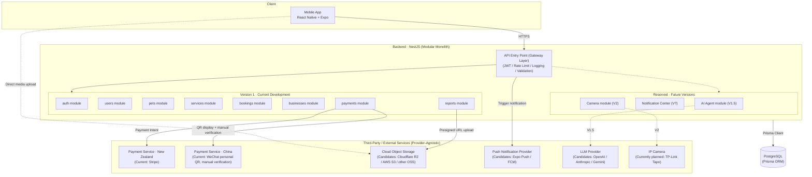
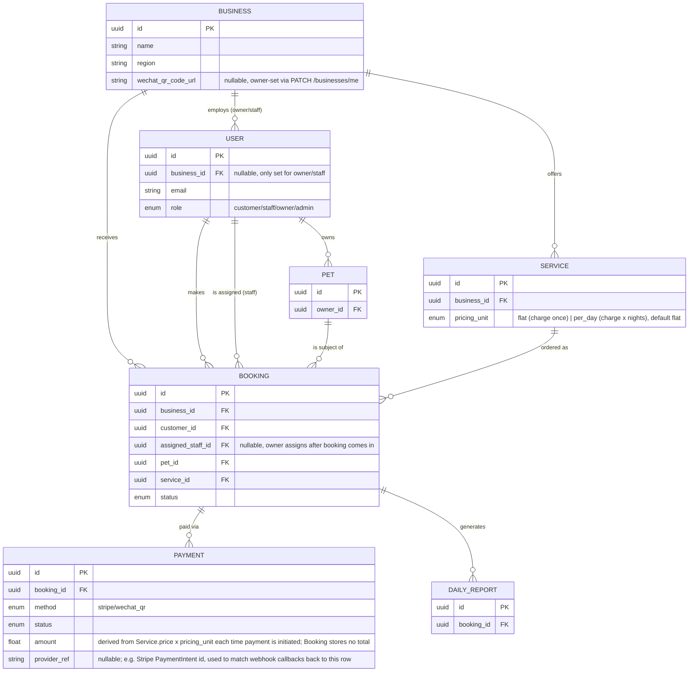
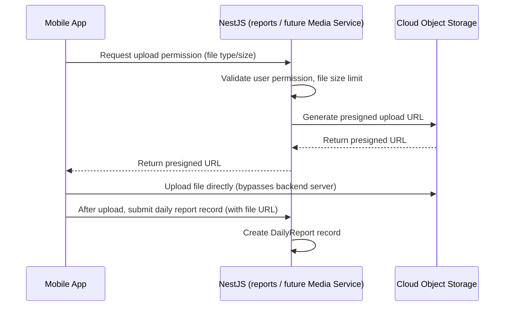
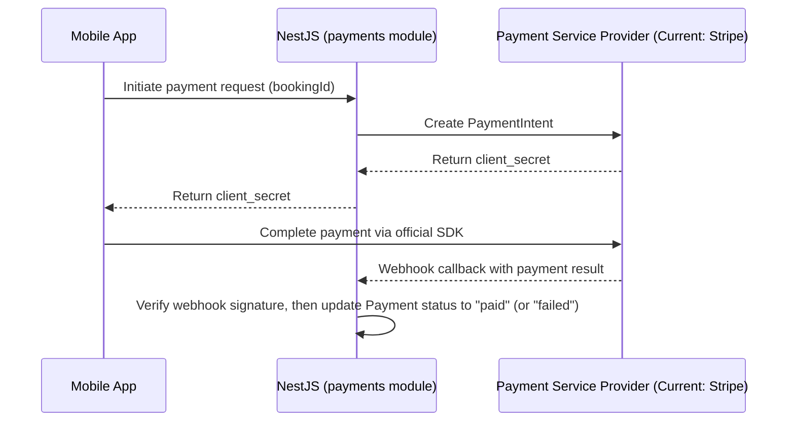
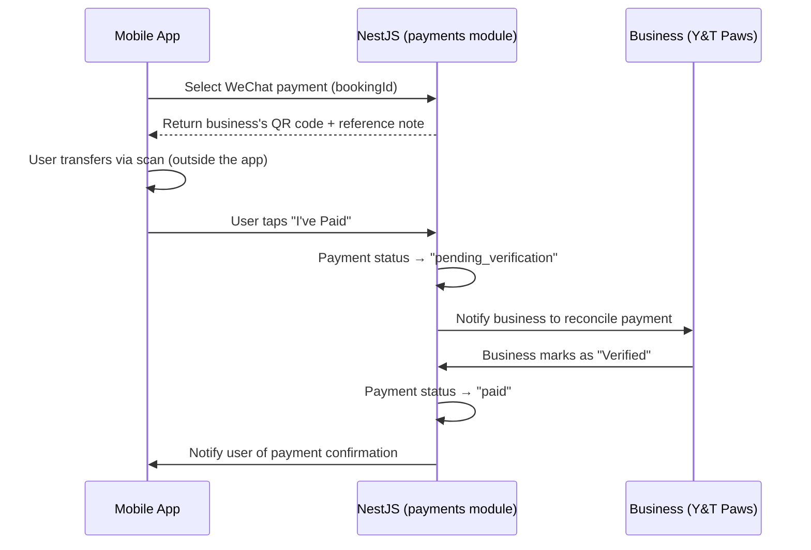
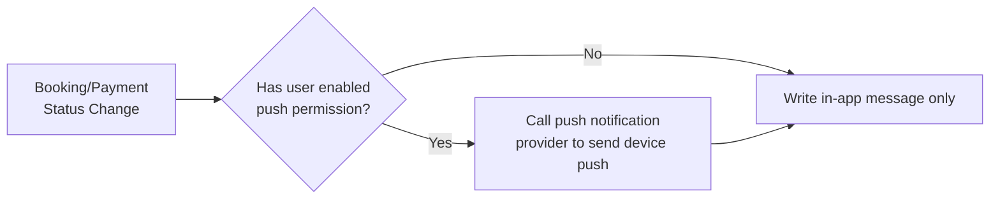
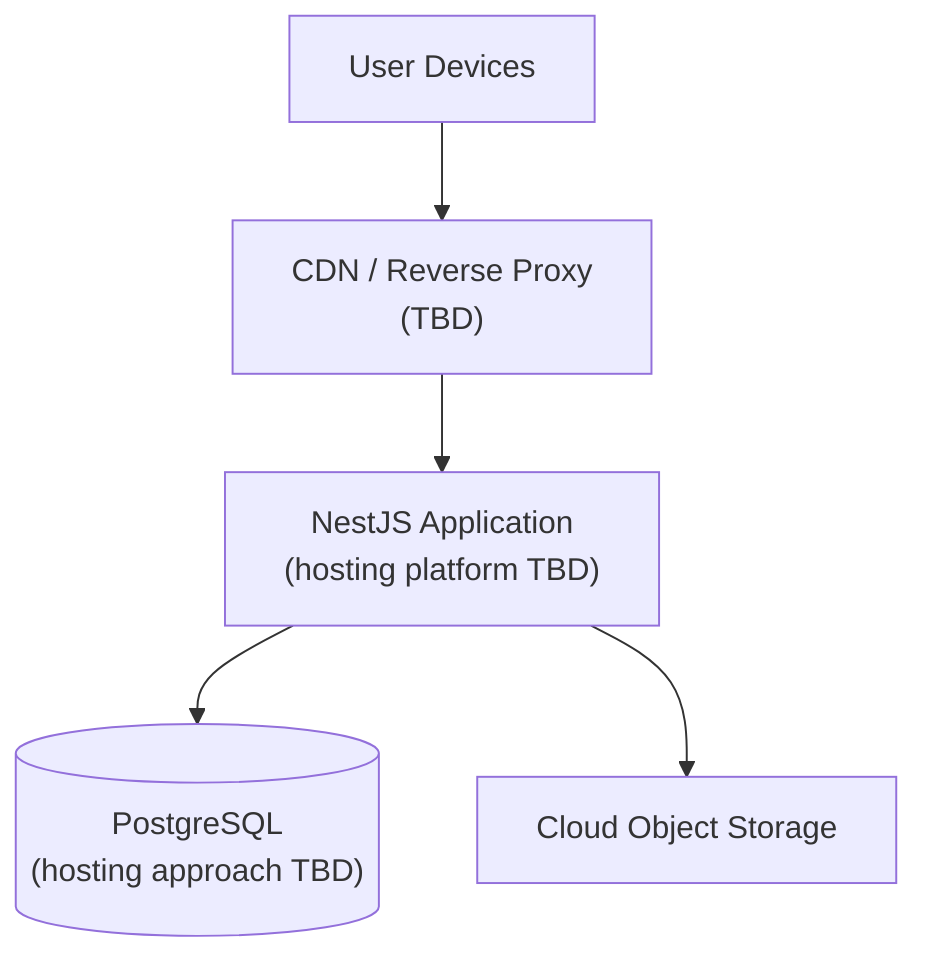

# 03 · System Architecture

**Document Status:** Draft v0.6
**Related Documents:** `01_Project_Overview.md`, `02_Product_Requirements.md`
**Last Updated:** 2026-07-26
**Maintainer:** Xiyun Liu (Product Owner & Developer)

> This document defines PetHome's overall system structure: how components are divided, how they communicate, and where data flows. Detailed database table structures are in `04_Database_Design.md`; detailed API definitions are in `05_API_Design.md`. This document is only responsible for defining the "skeleton."
>
> This document follows a **provider-agnostic** principle: unless there is a clear technical lock-in reason, all third-party service categories (storage, push, AI, cameras, etc.) only describe "what role this category of service plays," without binding to a specific vendor — this avoids having to rewrite the architecture document every time a vendor changes.

---

## 1. Architecture Overview

PetHome v1.0 uses a **Modular Monolith** architecture rather than microservices: a single NestJS application serves as the unified API entry point, internally divided into modules along business boundaries (corresponding to the six functional modules in `02_Product_Requirements.md`), sharing one PostgreSQL database.

**Why a modular monolith instead of microservices:**
- With only one developer (Lily) currently, the operational complexity of microservices (service discovery, cross-service transactions, multiple deployment pipelines) far exceeds what the team size can support
- NestJS's Module mechanism already supports clear boundary separation; if a module (e.g. AI Agent or Camera) genuinely needs to scale independently in the future, it can be extracted from the monolith at relatively low cost
- Aligns with the "Simplicity Before Complexity" design principle from `01_Project_Overview.md`

**Unified entry point (Gateway Layer):** All client requests pass through the same NestJS application first, rather than being spread across multiple independent services. This layer handles JWT authentication, rate limiting, request logging, and validation. This "Gateway Layer" is **not** an independently deployed gateway component (unlike, say, Kong, Nginx, or AWS API Gateway) — it is an architectural concept expressing "a single unified request entry point with cross-cutting concerns handled centrally." Concretely, it is implemented via NestJS's Middleware / Guard / Interceptor mechanisms sitting in front of Controllers and Services:

```
HTTP
  ↓
NestJS Gateway Layer (Middleware / Guard / Interceptor)
  ↓
Controller
  ↓
Service
```



**Diagram notes:**
- Solid lines = connections implemented in Version 1
- Dashed lines = connections only enabled in future versions; currently just reserved in the architecture
- The "Reserved · Future Versions" dashed box = not implemented now, only placeholder in the diagram, so readers can immediately see the gap between the system's eventual shape and current progress

---

## 2. Architecture Principles

The following principles underpin all subsequent design decisions (database, API, module boundaries); when in doubt, defer to these:

| Principle | Description |
|---|---|
| **Single Responsibility** | Each module handles logic within one business boundary only — e.g. `payments` only handles payment flows, not booking business logic |
| **Loose Coupling** | Modules interact through clearly defined interfaces, not by depending directly on each other's internal implementation |
| **High Cohesion** | Functionality within a module is closely related; loosely related functionality should not be crammed into the same module |
| **API First** | Define a clear API contract before implementing internal logic — enables parallel frontend/backend development and easier future replacement of implementations |
| **Cloud Native Ready** | The application is designed stateless, horizontally scalable, and deployable to any mainstream cloud platform without assuming vendor-specific proprietary capabilities |
| **Security by Design** | Security is not an afterthought — it's a default requirement considered at every layer, from database field design to API permission checks |

---

## 3. Component Responsibilities

### 3.1 Client (Mobile App)
- React Native + Expo, both iOS/Android
- Responsible for: UI rendering, local state management, calling backend REST APIs, uploading media files directly to cloud storage (see Section 5)
- Does not connect directly to the database, nor does it call payment provider server-side-key-related APIs directly (payment initiation is proxied by the backend to avoid exposing secret keys on the client)

### 3.2 Backend Modules (NestJS)

| Module | Responsibility | Corresponding PRD Module |
|---|---|---|
| `auth` | Registration (customer and self-service business/owner registration), login, JWT issuance/validation, role management | Module 1 |
| `users` | Basic user information management | Module 1 (supporting) |
| `pets` | Pet profiles, health records | Module 2 |
| `services` | Display and management of service offerings (boarding / drop-in, etc.) | Module 3 |
| `bookings` | Booking creation, status transitions, cancellation logic, owner-to-staff assignment | Module 3 |
| `businesses` | Business profile fields not set at registration (currently just the WeChat QR code image URL) | Module 4 (supporting) |
| `payments` | Payment initiation, WeChat manual verification flow, payment records | Module 4 |
| `reports` | Creation and viewing of pet daily reports | Module 6 |

> **Evolution direction for `reports`:** Currently `reports` only handles daily pet reports, and this name will remain unchanged. However, future private chat (v1.5) and camera screenshots/recordings (v2) will need the same media upload/storage capability. To avoid each module re-implementing media handling logic independently, the architecture will eventually extract a dedicated **Media Service** underneath `reports`, responsible specifically for interacting with cloud object storage. `reports`, the future Chat module, and the future Camera module would all call this unified Media Service rather than connecting to storage directly:
>
> ```
> Reports / Chat / Camera (future)
>          ↓
>     Media Service
>          ↓
>    Cloud Object Storage
> ```
>
> **Media Service is an architectural abstraction. It does not exist as an independent module in Version 1.** Version 1 does not need to actually extract this service yet — understanding this evolution direction is sufficient for now; the specific extraction timing will be determined in later documents.

> Push notifications do not get a dedicated backend module in Version 1 — they are triggered as a side effect within the `bookings`/`payments` modules. A dedicated `notifications` module will only be extracted once it evolves into a Notification Center (see `09_Notification_Design.md`).

### 3.3 Database (PostgreSQL + Prisma)
- A single PostgreSQL instance shared by all modules (typical for a modular monolith)
- Prisma serves as the ORM, handling schema definition, migrations, and type-safe queries
- Detailed table structures are in `04_Database_Design.md`, but the **multi-tenant field design principle** is established in Section 4 below since it affects all tables

---

## 4. Multi-Tenant Architecture Principles (Important)

Per the decision in Section 11 of `01_Project_Overview.md`: Version 1 serves only one business, Y&T Paws, but the data structure needs to be prepared for future multi-business support starting now.

### 4.1 Core Design: `Business` Table + `business_id` Foreign Key



**Key design notes:**
- A new `Business` table is added; in Version 1 it contains only one record (Y&T Paws)
- Core business tables — `Booking`, `Service`, `Payment` (indirectly via Booking) — all carry a `business_id` foreign key
- The `User` table's `business_id` is **nullable**: a regular Customer does not belong to any business (`business_id = null`); only Owner/Staff roles are associated with a specific business
- The benefit of this design: in Version 1, all query logic naturally filters by `business_id = Y&T Paws's ID`, so the code is nearly as simple as "pretending there's no multi-tenancy"; but when a second business is actually onboarded in the future, no schema changes are needed — only the application-layer logic for "how to isolate permissions across multiple business_id values" needs to be handled
- `Booking.assigned_staff_id` (nullable, FK to `User`) lets the Owner assign an incoming booking to one of their staff internally; assignment is required to reference a staff/owner user with the same `business_id` as the booking (see PRD US-03.5/US-03.6). Customers picking their own staff member is out of scope for now — see 4.2
- `Booking.status` only ever advances forward through `PATCH /bookings/:id/status` (owner/admin only): `pending → confirmed → in_progress → completed`, one step at a time; `cancelled` is a separate terminal state reached only via `PATCH /bookings/:id/cancel`. This endpoint isn't tied to a specific PRD user story — it exists because `in_progress` is a precondition for daily reports (US-06.1) and nothing else in the API could ever produce that transition
- `Booking` itself stores no total/amount. `Payment.amount` is computed at payment-initiation time from `Service.price` and `Service.pricing_unit` (§6 below), so changing a service's price never requires touching historical bookings

### 4.2 What's Deliberately Out of Scope for Now
Written down explicitly to avoid scope creep during development:
- ❌ No multi-business switching UI in the business dashboard
- ❌ No cross-business aggregated reporting
- ❌ No complex permission matrix based on `business_id` (Version 1 permission logic remains a simple binary: "Customers can only see their own data; Owners can see all of Y&T Paws's data")
- ❌ No customer-facing staff selection (customers don't see or choose `assigned_staff_id`; only the Owner sets it) — deferred until staff headcount justifies the extra UI (profiles, availability, etc.)
- ✅ Only: core tables carry a `business_id` field, and queries consistently apply this filter
- ✅ Owner-to-staff booking assignment via `assigned_staff_id`

---

## 5. Media Storage Architecture (Media / Pet Daily Report Photos & Videos)

PetHome adopts a cloud object storage architecture for media files. The specific provider (e.g., Cloudflare R2, AWS S3, Alibaba Cloud OSS, Tencent Cloud COS) will be selected during deployment planning. The architecture is provider-agnostic.

### 5.1 Upload Flow: Presigned URL Pattern



**Why not upload to the backend server first, then forward to cloud storage?**
- Avoids the backend server bearing the traffic load of large files (especially video)
- Faster upload speed and better user experience
- The backend only handles "issuing upload permission" and "recording the upload result" — clearer responsibility

### 5.2 Relationship with Other Modules
- Currently only the `reports` (pet daily reports) module uses media storage
- Future v1.5 private chat and v2 camera screenshots/recordings will reuse the same cloud storage infrastructure (see Section 3.2, Media Service evolution direction) rather than each implementing it independently

---

## 6. Payment Architecture

Payment services also follow the provider-agnostic principle: the architecture defines the abstract concept of a "payment method," with Stripe and WeChat being the two concrete implementations for the current stage.

**Amount calculation:** `Booking` has no stored total. Whenever a payment is initiated (Stripe or WeChat), the `payments` module computes the amount from the booking's `Service`: if `Service.pricing_unit` is `flat`, the amount is just `Service.price`; if `per_day`, it's `Service.price × ceil((booking.endDate − booking.startDate) / 1 day)` (minimum 1 day). This keeps `Service.price` changes from ever needing to touch past bookings, at the cost of recomputing the amount fresh each time a payment is attempted for the same booking.

### 6.1 Stripe Payment Flow (New Zealand Users)



**Implementation note:** the webhook updates `Payment.status`, not `Booking.status` — `Booking`'s status enum (`pending/confirmed/in_progress/completed/cancelled`) has no "paid" state; whether a booking has been paid is read off its associated `Payment` row(s) instead. The webhook handler matches the callback back to a `Payment` via `Payment.providerRef` (the Stripe PaymentIntent id, stored when the PaymentIntent is created) and requires `NestFactory.create(AppModule, { rawBody: true })` so the raw request body is available for Stripe's signature check before JSON-parsing runs.

### 6.2 WeChat QR Payment Flow (Chinese Users, Manual Verification)



**Implementation note:** as with Stripe, every state change here is on `Payment.status`, never `Booking.status`. "Notify the business to reconcile" and "notify user of payment confirmation" are not implemented — there's no Notification module yet (§7). The QR code itself is just `Business.wechat_qr_code_url`, a plain string the owner sets via `PATCH /businesses/me`; there's no image upload endpoint, consistent with §5's presigned-upload flow not being implemented yet.

**Key difference:** The Stripe path is driven automatically by webhook; the WeChat path is driven by the business's manual action. These two paths are two independent strategy implementations within the `payments` module (corresponding to the "pluggable payment method" design principle in `02_Product_Requirements.md`), sharing the same `Payment` state machine but with different triggers for state transitions.

---

## 7. Notification Architecture (Version 1 Simplified)

Version 1 does not build a dedicated Notification module. The simplest implementation is used: the `bookings`/`payments` modules directly call a push notification provider (candidates: Expo Push, Firebase Cloud Messaging) when status changes occur, while also writing an in-app message record.



The full design for evolving into a Notification Center (unifying Push/Email/SMS/WeChat notifications, covering all sources — bookings, payments, chat, AI, camera, promotions) is in `09_Notification_Design.md`.

---

## 8. Security Architecture (Summary)

Detailed plans are in `11_Security.md`; the Version 1 baseline is listed here:

| Item | Approach |
|---|---|
| Transport Security | HTTPS site-wide |
| Authentication | JWT, carried in the request header by the client after login |
| Password Storage | Encrypted storage (e.g. bcrypt), never plaintext |
| Access Control | Access control based on the `role` field (Customers can only access their own data; Owners can access their business's data) |
| Secret Management | Third-party secrets (payment providers, cloud storage, LLM services) live only in backend environment variables and are never sent to the client |

---

## 9. Logging and Monitoring (Placeholder)

Version 1 does not introduce a dedicated logging/monitoring system; it relies only on NestJS's default log output and the hosting platform's basic logging capability.

Future versions will introduce a complete observability stack, generally in this direction:

```
Application Logs
        ↓
Metrics
        ↓
Monitoring
        ↓
Alerting
        ↓
Audit Logs (for tracing sensitive operations such as payments and permissions)
```

Tools such as Prometheus and Grafana would fall under the Metrics/Monitoring layer. Specific tool selection (e.g. Sentry, Datadog, self-hosted ELK) will be determined in future versions based on actual needs; this direction is recorded here so it isn't forgotten.

---

## 10. Environments

The project uses three standard environments to avoid contaminating production data with development/testing data:

| Environment | Purpose | Config File |
|---|---|---|
| Development | Local development and debugging | `.env.development` |
| Testing | Feature testing, UAT | `.env.testing` |
| Production | Real business operation | `.env.production` |

**Principle:** Sensitive configuration such as database connection strings and third-party secrets (payment providers, cloud storage, LLM services) is always injected via environment variables and never committed to the repository; `.env.*` files are added to `.gitignore`, with only `.env.example` committed as a field-documentation template.

---

## 11. Deployment Architecture (Placeholder, TBD)

The specific deployment platform has not yet been decided and will be determined in `10_Deployment.md`. A generic deployment topology is given here to clarify the relationships between layers, without binding to a specific vendor:



---

## 12. Technology Stack Summary

| Layer | Technology Choice |
|---|---|
| Mobile | React Native + Expo + TypeScript |
| Backend Framework | NestJS |
| Database | PostgreSQL |
| ORM | Prisma |
| Authentication | JWT |
| Payment Services | Payment providers (Current: Stripe [NZ], WeChat personal QR [China, manual verification]) |
| Media Storage | Cloud object storage (Candidates: Cloudflare R2 / AWS S3 / other OSS, TBD) |
| Push Notifications | Push notification provider (Candidates: Expo Push / Firebase Cloud Messaging, TBD) |
| AI (from v1.5) | LLM provider (Candidates: OpenAI / Anthropic / Google Gemini) |
| Camera (from v2) | IP camera (Currently planned: TP-Link Tapo) |
| Deployment (TBD) | Candidates: AWS / Railway / Render — see `10_Deployment.md` |

---

## 13. Architecture Decision Records (ADR Summary)

| Decision | Choice | Rationale |
|---|---|---|
| Monolith vs. Microservices | Modular monolith | Team size (1 developer) cannot support microservices operational complexity |
| Multi-tenant implementation | Shared database + `business_id` field isolation | Lower cost than "one database per business," more future-ready than "ignoring multi-tenancy entirely"; aligns with Version 1 serving a single business while reserving structural extensibility |
| Media upload approach | Client uploads directly to cloud storage (presigned URL) | Avoids backend bearing large-file traffic load; better upload experience |
| WeChat payment integration approach | Personal QR code + manual verification, rather than the official merchant API | The official merchant API has a high application threshold; manual verification is a pragmatic transitional approach for now, with an extension point reserved for switching to the official API in the future |
| Third-party service description approach | Provider-agnostic | Storage, push, AI, camera, etc. categories only define responsibilities without binding to a specific vendor, reducing future documentation and code changes when switching providers |
| Business onboarding | Self-service registration (`POST /auth/register-business`) creates the `Business` row and its first `owner` User atomically; no admin-run setup step, not even for Y&T Paws | Keeps onboarding identical for the first tenant and the hundredth, which the Version 4 resale model depends on; building it self-service now is no more expensive than a one-off script and avoids retrofitting later |
| Staff provisioning | Owner creates staff accounts directly (`POST /auth/staff`) with a system-generated temporary password returned to the owner, rather than an email invite flow | No transactional email infrastructure exists yet; owners already relay information to staff manually (WeChat, phone), so this fits current operating reality without new infrastructure |
| Service pricing model | `Service.pricing_unit` enum (`flat` \| `per_day`, default `flat`) rather than a fixed per-service formula | Boarding is naturally priced per night, grooming/house-visits per session; a single field lets both coexist without a booking-total field or per-service special-casing in the payments module |
| Payment amount storage | `Payment.amount` computed fresh from `Service.price`/`pricing_unit` at initiation time; `Booking` stores no total | Avoids a stale/duplicated total that could drift from the service's actual price; the tradeoff is that a service price change could affect a not-yet-paid booking, which is acceptable at V1's scale |
| Stripe webhook correlation | `Payment.providerRef` stores the Stripe PaymentIntent id; the webhook handler looks up the `Payment` row by that id rather than by `bookingId` | A booking can have multiple payment attempts (retries after a decline); correlating by the specific PaymentIntent id (not just bookingId) avoids updating the wrong attempt |
| Business profile updates | Minimal `businesses` module with a single `PATCH /businesses/me` (owner/admin only), rather than a general business-settings module | The only post-registration business field needed so far is the WeChat QR code URL; a fuller business-profile module can be built when more fields (e.g. logo, hours) are actually needed |
| Booking status progression | `PATCH /bookings/:id/status`, forward-only through `pending → confirmed → in_progress → completed`, one step at a time (owner/admin only) | Daily reports (US-06.1) require a booking to be `in_progress`, and no endpoint could produce that transition before this was added; forward-only, single-step validation keeps the state machine simple and prevents skipping steps or reviving a cancelled booking |

---

## Change Log

| Date | Version | Change | Author |
|---|---|---|---|
| 2026-07-02 | v0.1 | Initial draft: overall architecture diagram, module responsibilities, multi-tenant design principles, media storage architecture, payment architecture (Stripe + WeChat), simplified notification architecture, security baseline, deployment placeholder, technology stack summary, architecture decision records | Xiyun Liu |
| 2026-07-02 | v0.2 | Added API Gateway conceptual layer; architecture diagram annotated with Version 1 / Reserved zones; added future Media Service evolution note to the `reports` module; storage/push/AI/camera all changed to provider-agnostic phrasing; added "Architecture Principles," "Logging and Monitoring," and "Environments" sections | Xiyun Liu |
| 2026-07-02 | v0.3 | Renamed "API Gateway" to "API Entry Point (Gateway Layer)" for accuracy (not an independent component like Kong/Nginx/AWS API Gateway); clarified Media Service is an architectural abstraction not implemented in Version 1; added Metrics step to the logging/monitoring pipeline; translated to English | Xiyun Liu |
| 2026-07-22 | v0.4 | Added `Booking.assigned_staff_id` to the multi-tenant ERD and design notes for owner-to-staff booking assignment; documented that customer-facing staff selection is deliberately out of scope for now | Xiyun Liu |
| 2026-07-22 | v0.5 | Documented self-service business registration and owner-provisioned staff accounts as ADR entries; updated `auth` module responsibility to include business/owner registration | Xiyun Liu |
| 2026-07-26 | v0.6 | Synced with the now-implemented `payments`, `reports`, and `businesses` modules: added `Service.pricing_unit`, `Payment.provider_ref` and `Business.wechat_qr_code_url` to the multi-tenant ERD; documented the `PATCH /bookings/:id/status` lifecycle endpoint; corrected the Stripe/WeChat sequence diagrams, which incorrectly showed `Booking.status` becoming "Paid" — that field lives on `Payment.status` instead, since `Booking`'s status enum has no paid state; added amount-calculation and ADR entries for these decisions | Xiyun Liu |
