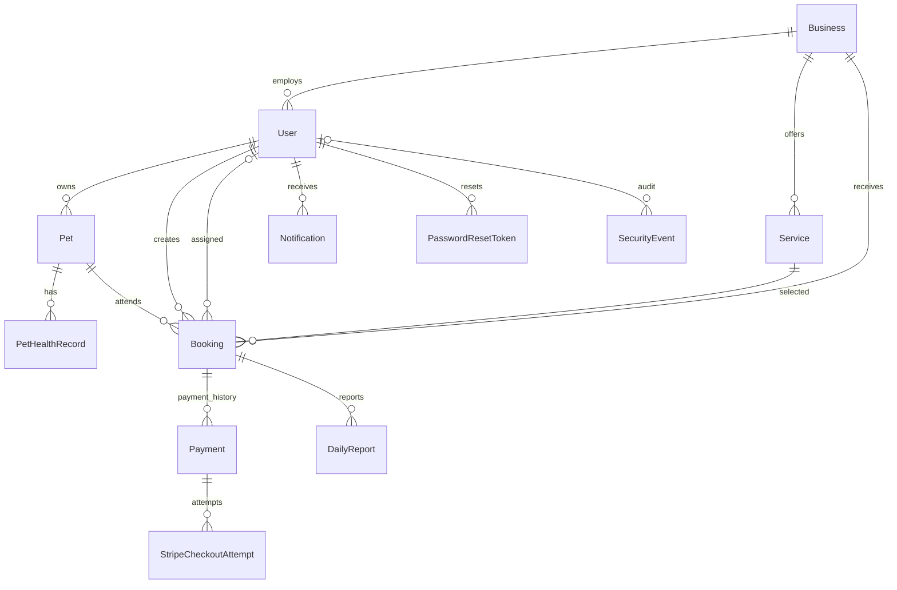

# Y&T Paws Platform — Database Design

**Version:** 1.0  
**Updated:** 2026-08-07  
**Status:** Implemented; this document describes the current Prisma/PostgreSQL schema.

## 1. Scope and source of truth

PostgreSQL is the transactional store and Prisma is the data-access layer. The executable source of truth is `yt-paws-backend/prisma/schema.prisma` plus the ordered SQL migrations in `yt-paws-backend/prisma/migrations`. This document explains that implementation; it does not replace migrations.

V1 intentionally supports one onboarded `Business`. Core rows already carry `businessId` where tenancy matters so a later multi-business release can extend the product without redesigning bookings and payments.

## 2. Relationship overview

## 3. Enumerations

| Enum | Values | Meaning |
|---|---|---|
| `Role` | `customer`, `staff`, `owner`, `admin` | `admin` is a business-scoped manager in V1, not a cross-business platform administrator. |
| `BookingStatus` | `pending`, `confirmed`, `in_progress`, `completed`, `cancelled` | Booking lifecycle. |
| `PaymentMethod` | `stripe`, `wechat_qr` | Supported payment rails. |
| `PricingUnit` | `flat`, `per_day` | One charge or calendar-day pricing. |
| `PaymentStatus` | `pending`, `pending_verification`, `paid`, `failed`, `refunded`, `cancelled`, `refund_pending` | Payment and refund state machine. |
| `CheckoutAttemptStatus` | `pending`, `succeeded`, `expired` | Individual Stripe Checkout Session state. |

## 4. Tables

### 4.1 Business and identity

| Model | Important fields | Rules |
|---|---|---|
| `Business` | `id`, `name`, `region?`, `wechatQrCodeUrl?`, `maxConcurrentBookings?`, timestamps | A null capacity means unlimited. QR code is an object-storage URL. |
| `User` | `businessId?`, unique `email`, password hash, profile fields, `role`, `pushToken?`, `isActive`, `tokenVersion`, `mustChangePassword`, lockout fields, staff capacity, `deletedAt?` | Customers have no business membership. Token version invalidates old sessions after security-sensitive changes. Deleted accounts are anonymized rather than physically removed where retention is required. |
| `PasswordResetToken` | `userId`, unique `tokenHash`, `expiresAt`, `usedAt?` | Only the hash is stored. Tokens are one-use and cascade-delete with the user. Indexed by user and expiry. |
| `SecurityEvent` | `userId?`, `type`, `ipAddress?`, `emailHash?`, `metadata?`, `createdAt` | Persistent login/reset audit and rate-limit evidence. User deletion sets the relation null. Indexed for IP, email hash and user lookups. |

### 4.2 Pet care catalogue

| Model | Important fields | Rules |
|---|---|---|
| `Pet` | profile fields, `photoUrl?`, `ownerId`, timestamps | Access is owner-scoped except booking-specific care-details access for assigned staff/managers. |
| `PetHealthRecord` | `petId`, `type`, `date`, `nextDate?`, `notes?` | Health history belongs to a pet; V1 accepts the product-defined record type string. |
| `Service` | `businessId`, `name`, `description?`, decimal `price`, `pricingUnit`, `durationMinutes?`, `maxConcurrentBookings?`, `isActive` | Archive-only lifecycle through `isActive`; null capacity means unlimited. |

### 4.3 Booking and operations

| Model | Important fields | Rules |
|---|---|---|
| `Booking` | business/customer/staff/pet/service FKs, `unitPrice`, `pricingUnit`, `status`, `startDate`, `endDate` | Price and pricing unit are snapshots. End must be after start. Active overlap checks cover pet, business, service and assigned staff. Cancelled/completed rows do not consume capacity. |
| `DailyReport` | `bookingId`, `text?`, `mediaUrls[]`, `createdAt` | At least useful text/media is validated by the API. Media values are object-storage URLs. |
| `Notification` | `userId`, `title`, `body`, `readAt?`, `createdAt` | Created as booking/payment side effects; clients list and mark read. |

Capacity is concurrency-based, not a daily counter. An overlap uses the half-open interval rule `existing.startDate < requested.endDate AND existing.endDate > requested.startDate`; adjacent bookings therefore do not overlap. Business, service and staff limits are independently configurable, and null means no cap.

### 4.4 Payments

| Model | Important fields | Rules |
|---|---|---|
| `Payment` | `bookingId`, `method`, decimal `amount`, `status`, reference/audit fields, refund fields, `stripeRefundId?` | Full refunds only in V1. A booking cancellation does not mutate or refund its payment. |
| `StripeCheckoutAttempt` | `paymentId`, unique `sessionId`, `status`, `paymentIntentId?`, `createdAt` | Every new Checkout Session is retained so delayed webhooks can be reconciled safely. |

Three hand-written partial unique indexes enforce financial invariants that Prisma cannot express:

- one pending Stripe payment per booking;
- one active WeChat payment per booking;
- at most one `paid` or `refund_pending` payment across methods per booking.

Stripe refund requests use the Payment ID as the provider idempotency key. `refund_pending` reserves the paid slot during the provider call; reconciliation handles a crash after Stripe succeeds but before the final database write.

## 5. Index strategy

Primary keys are UUIDs and user email, reset-token hash, and Stripe Session ID are unique. Booking capacity queries use composite indexes on `(resourceId, status, startDate, endDate)` for pet, business, service and assigned staff. Customer history uses `(customerId, createdAt)`. Security-event and reset-token indexes support persistent rate limits and expiry cleanup.

The overlap checks run in serializable transactions. PostgreSQL indexes reduce the candidate set; the transaction isolation prevents two simultaneous requests from both observing spare capacity and committing beyond the configured cap.

## 6. Deletion and retention

Account deletion immediately disables authentication, increments `tokenVersion`, removes reset credentials and personal push access, and anonymizes identity fields. Pet/profile media and non-required personal care data are removed according to the implemented deletion service. Booking and payment records required for transaction, refund, tax, dispute and audit obligations are retained in de-identified form. Financial records must never be hard-deleted through an App endpoint.

The external account-deletion page and privacy policy must describe the same behavior. Production retention periods remain a legal/business configuration decision and must be stated before store submission.

## 7. Media storage

PostgreSQL stores object URLs, not image bytes. The media service issues short-lived S3/R2-compatible presigned PUT URLs for approved MIME types, size limits and purposes (`pet`, `report`, `wechat-qr`). Bucket CORS and lifecycle policies are production infrastructure settings.

## 8. Migration and production operations

- Apply committed migrations with `prisma migrate deploy`; never use `db push` in production.
- Review generated migrations with `--create-only`, because Prisma cannot model the partial payment indexes and may propose dropping them.
- Back up the production database automatically and test restoration.
- Run `/health/ready` after deployment; it performs a real database query.
- Monitor failed migrations, payment/webhook errors, long-lived `refund_pending` rows and backup age.

## Change Log

| Date | Version | Change |
|---|---|---|
| 2026-08-07 | 1.0 | Documented the implemented PostgreSQL/Prisma model, capacity indexes, payment constraints, deletion retention and migration operations. |
