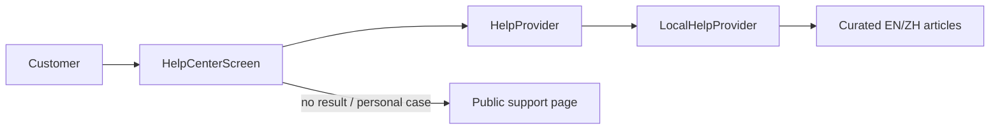
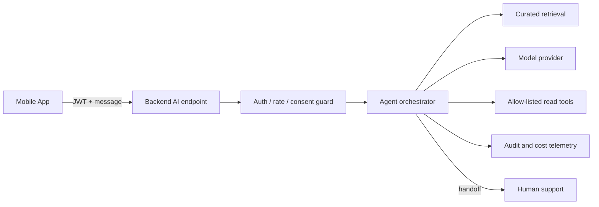

# Y&T Paws Platform — AI Agent Design

**Version:** 1.0  
**Updated:** 2026-08-07  
**Status:** V1 non-AI Help Center implemented; paid AI agent reserved for a later release.

## 1. Decision

V1 does not call an LLM and has no AI-provider cost. The shipped customer-assistance feature is a deterministic, bilingual Help Center backed by curated local articles. It answers common product questions and sends personal, unmatched or policy-sensitive cases to human support.

The App already depends on a small `HelpProvider` interface, so a later remote assistant can be introduced without rebuilding the Help Center screen. This is an extension seam, not an inactive AI integration: there is currently no model SDK, provider key, agent endpoint, conversation database or autonomous tool execution.

## 2. Current V1 implementation

### 2.1 User experience

- Entry point: Profile → Help Center.
- Languages: English and Simplified Chinese, following the App language selection.
- Categories: booking, payments, pets/reports and account.
- Search: normalized case-insensitive substring matching over question, answer and curated keywords.
- Results: expandable question/answer cards; an empty result offers human support.
- Escalation: opens the backend-hosted `/support` page. The Help Center never pretends that a personal booking or payment has been inspected.

### 2.2 Code boundary

`HelpProvider.search(language, query, category?)` returns `Promise<HelpArticle[]>`. `LocalHelpProvider` implements that contract using bundled articles. `HelpCenterScreen` knows only the interface and renders results; it does not import an AI SDK.

This boundary is deliberately read-only. A future provider may return answers through a compatible UI, but booking, payment, refund, account and staff mutations require separate authenticated backend tools and explicit confirmation.

### 2.3 Current data handling and cost

Search executes on-device. Queries, selected articles and categories are not sent to Y&T Paws, OpenAI or another processor, and no conversation history is stored. Runtime provider cost is zero. Normal public support-page access may still produce ordinary web-server access logs as described by the privacy policy.

## 3. V1 safety rules

The Help Center:

- provides general guidance only;
- does not determine refund eligibility or override cancellation rules;
- does not give veterinary diagnosis or emergency advice;
- does not claim to know a booking, payment, pet or account state;
- does not expose secrets, internal logs or other users' data;
- cannot call APIs or change records;
- routes unresolved and account-specific questions to human support.

Curated content must remain synchronized with shipped behavior. In particular, cancellation is unavailable at or within 24 hours of service start, and cancellation does not automatically refund a payment.

## 4. Future paid AI architecture

Paid AI remains a post-V1 option and must be enabled only after production booking, payment, email, monitoring and support operations are stable.

Provider credentials must exist only in backend environment variables. The mobile bundle must never contain an AI key or call a model provider directly. The backend owns authentication, tenant/ownership filters, prompt construction, tool authorization, redaction, rate limits, budgets and audit events.

## 5. Proposed future capabilities

Roll out in stages:

1. General FAQ generation grounded only in approved Help Center and policy content.
2. Authenticated read-only answers for the caller's own bookings, payments and reports.
3. Drafted support handoff containing a user-approved summary.
4. Carefully allow-listed actions only if there is a demonstrated operational need.

The first paid release should remain read-only. Creating/cancelling bookings, changing pet health data, marking payments, verifying transfers, refunding money, deleting accounts and changing staff access are excluded until each action has explicit confirmation, deterministic server-side authorization, idempotency and an audit trail. Refund and staff/account administration should continue to require a human manager.

## 6. Tool and permission model

Every future tool must accept the authenticated server identity rather than a user-supplied user/business ID. Service-layer authorization remains the source of truth.

| Tool class | Initial policy | Examples |
|---|---|---|
| Public knowledge | Allow | Search approved FAQs, terms and support guidance. |
| Customer-owned read | Allow after authenticated rollout | Read caller's booking/payment/report summaries with minimal fields. |
| Pet health read | Restricted | Only caller-owned pets or existing booking-scoped care authorization. Avoid sending unnecessary health details to the model. |
| Business read | Role-scoped | Same-business owner/admin/staff data only, with assigned-staff rules preserved. |
| Mutations | Deny initially | Booking cancellation, profile edits, payment/refund actions and account deletion. |
| Financial/admin actions | Human-only | Payment verification, refunds, staff status/capacity and business settings. |

Tool output should be minimized and structured. Never provide password hashes, reset tokens, JWTs, provider secrets, full card data, raw security events or unrelated customer records to a model.

## 7. Prompt-injection and output controls

- Treat user text, database content, uploaded files and retrieved documents as untrusted data, never as system instructions.
- Keep system policy and tool schemas server-controlled and versioned.
- Use an explicit tool allow-list and validate every argument with DTO/schema validation.
- Re-authorize every tool call; model output is not authorization.
- Prefer structured results and fixed UI affordances over executable free-form instructions.
- Do not render model-generated links or rich content without scheme/domain validation.
- Refuse requests for secrets, cross-user data, internal prompts or policy bypass.
- Provide a visible human-support path and identify generated answers as automated when AI is enabled.

## 8. Privacy, retention and consent

Before enabling remote AI, update the privacy policy, App Store App Privacy and Google Play Data Safety disclosures for the chosen processor and data flow. Users must be told when a query leaves the device.

Default design:

- send the minimum context required for the current answer;
- exclude pet health details unless essential and authorized;
- redact contact data and provider references where possible;
- do not train provider models on customer data; select an API/business-data offering with appropriate terms;
- define short conversation and trace retention periods;
- support deletion/export obligations without deleting legally retained financial records;
- store consent/policy version when required.

## 9. Reliability and human handoff

AI failure must not block normal booking, payment or support functions. Timeouts, provider errors, budget exhaustion and unsafe/low-confidence answers fall back to curated Help Center results and the support page. The App should clearly distinguish live business data from general guidance.

For handoff, pass only a user-reviewed summary and stable internal reference IDs; do not silently email or message staff. Production monitoring should track provider availability and safety failures without logging raw sensitive conversations by default.

## 10. Cost controls

AI remains off by default behind a backend feature flag. Before enabling it:

- set per-user/IP request limits and daily/monthly spend ceilings;
- cap input, retrieved context and output tokens;
- cache only non-personal approved FAQ answers;
- use deterministic local search before an LLM call;
- select the smallest model that meets measured quality needs;
- alert before and at budget thresholds;
- provide an immediate kill switch that restores local Help Center behavior.

The App must work fully when the paid feature flag is disabled.

## 11. Evaluation and release gates

A paid assistant is not production-ready until it passes a bilingual evaluation set covering bookings, cancellation, payments/refunds, pet/report privacy, account deletion and adversarial prompt injection.

Minimum gates:

- no cross-user or cross-business data disclosure;
- no unsupported claim of completed actions;
- correct escalation for refunds, emergencies and account-specific uncertainty;
- policy-grounded answers in English and Chinese;
- latency, error-rate and cost targets measured in staging;
- privacy/store disclosures updated;
- support team can inspect safe audit metadata and disable the feature.

## 12. Explicitly out of scope

- Paid model integration in V1.
- Autonomous booking, cancellation, refund or account actions.
- Veterinary diagnosis.
- Voice agent, camera interpretation or proactive outreach.
- Training a custom model on customer conversations.
- Exposing provider selection or secrets in the App.

## Change Log

| Date | Version | Change |
|---|---|---|
| 2026-08-07 | 1.0 | Documented the implemented zero-cost Help Center and the security, privacy, tool, rollout, evaluation and cost boundaries for any future paid AI agent. |
