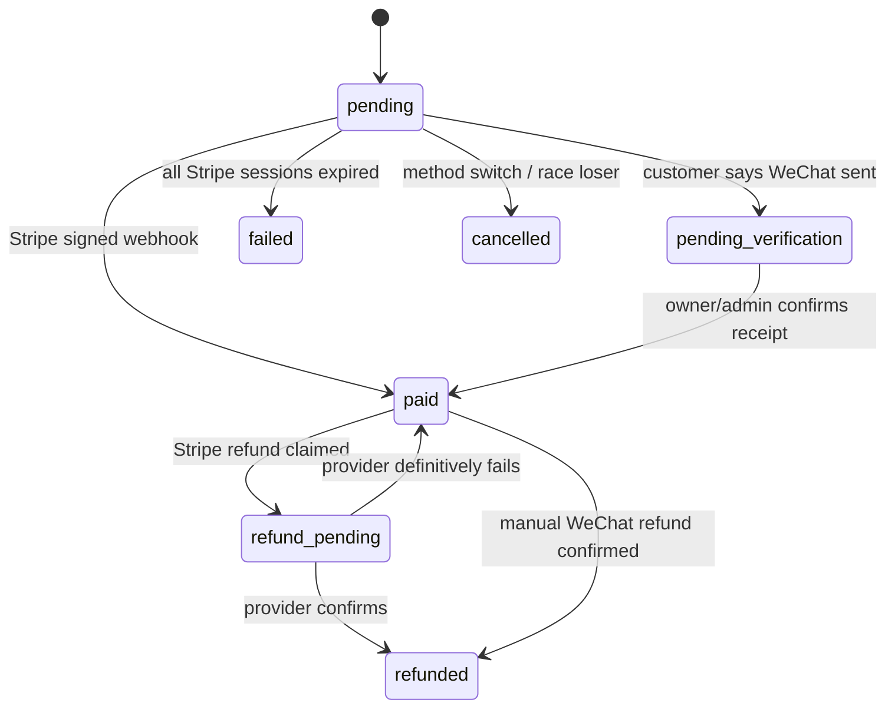

# Y&T Paws Platform — Payment Design

**Version:** 1.0  
**Updated:** 2026-08-07  
**Status:** V1 code implemented; real Stripe/WeChat production verification remains an external launch gate.

## 1. Scope and principles

V1 supports Stripe-hosted card checkout in NZD and manual WeChat QR transfers. The backend is the source of truth: the App never supplies an amount, never handles card details and never marks Stripe payments successful from a browser redirect.

Core principles are price snapshots, one payment holding money per booking, signed provider events, atomic state transitions, provider idempotency and visible recovery for ambiguous refunds.

## 2. Data model

- `Booking.unitPrice` and `Booking.pricingUnit` snapshot the Service at booking creation.
- `Payment` stores method, decimal amount, state, WeChat reference, verification and refund audit fields.
- `StripeCheckoutAttempt` stores every Checkout Session, its state and captured PaymentIntent ID.
- Partial unique PostgreSQL indexes enforce one active payment per method and at most one `paid`/`refund_pending` payment across methods.

Flat services charge once. `per_day` services charge `unitPrice × max(1, ceil(duration / 24h))`. Amounts are converted to Stripe minor units only after loading the server snapshot.

## 3. State machines

Booking cancellation and payment refund are deliberately independent. Cancelling never changes a Payment; refunding never changes Booking status.

## 4. Stripe Checkout

1. Customer calls `POST /payments/stripe/:bookingId` with an allow-listed App return URL.
2. Backend verifies booking ownership and absence of paid/refund-pending or WeChat-pending-verification money.
3. An abandoned pending WeChat method is cancelled.
4. Backend reuses the pending Stripe `Payment`, creates a fresh Checkout Session and records a `StripeCheckoutAttempt`.
5. App opens the hosted Checkout page and polls `GET /payments/:id` after return.
6. Only a correctly signed `checkout.session.completed` webhook changes the Payment to paid.

Every retry gets a new Session because old Sessions may remain payable. Switching away from Stripe marks local pending payment cancelled and best-effort expires every open provider Session. If a late Session still captures money, the code records the race loser as cancelled and notifies business managers that a manual refund is required.

Webhook processing uses the raw request body and `STRIPE_WEBHOOK_SECRET`. Attempt and Payment transitions use conditional `updateMany` claims, so duplicate/concurrent webhook delivery does not duplicate state changes or notifications.

## 5. WeChat QR flow

The owner uploads a static personal collection QR code through Business Settings. Customer initiation returns that URL, the server-calculated amount and a stable `PAWS-…` reference. A pending/pending-verification Payment is reused on screen reopen.

The customer action “I've paid” changes `pending → pending_verification` and alerts managers. Owner/admin must check the real transfer before `PATCH /payments/:id/verify` changes it to paid. The database cross-method index catches a simultaneous Stripe success; because money may have moved on both rails, the loser is flagged for manual refund rather than silently treated as successful revenue.

## 6. Refunds and recovery

V1 supports full refunds only. Owner/admin supplies a required reason.

- WeChat: the UI explicitly asks whether money has already been returned; after confirmation the database atomically changes paid to refunded.
- Stripe: backend first claims `paid → refund_pending`, calls Stripe using `refund_<paymentId>` as the idempotency key, and stores `stripeRefundId`.
- Definite provider rejection returns the Payment to paid.
- Network/API ambiguity remains `refund_pending`; refund webhooks or `POST /payments/:id/reconcile-refund` recover it.
- A monitor alerts when a refund remains pending beyond the configured operational threshold.

## 7. Authorization and data exposure

Customers can start and view only payments for their bookings and mark only their own WeChat payment sent. Owner/admin actions are limited to their `businessId`. Staff cannot verify or refund. Stripe webhooks use signature authentication rather than JWT.

Card numbers, CVC and full card data never enter this system. API responses expose only operational payment state, amount and safe provider/reference metadata required by the relevant user.

## 8. Failure handling and observability

- In-app notifications are written for success, failure, verification and refund outcomes.
- Business managers are notified about WeChat verification and double-payment refund needs.
- Invalid/failed webhook processing emits an operational alert.
- Long-lived `refund_pending` rows emit deduplicated alerts.
- Provider outages do not convert uncertain results into false success/failure.

Operational support should use internal Payment/Booking IDs plus Stripe Session, PaymentIntent and Refund IDs. Logs and alerts must not include card data, JWTs or customer media.

## 9. Production configuration

Required: verified Stripe business, `sk_live_…`, endpoint-specific `whsec_…`, HTTPS API/web URLs, configured webhook events, real WeChat QR image, support contact and an HTTPS alert receiver. Production startup rejects non-live Stripe keys or malformed webhook secrets.

Stripe Checkout for this App pays for real-world pet-care services, not digital content. Store review notes should state this clearly.

## 10. Release verification checklist

- Test and live modes separately; never mix keys, webhook secrets or records.
- Successful/abandoned/retried Stripe Checkout and duplicate webhook delivery.
- Old Session after switching to WeChat; WeChat after an open Stripe attempt.
- Repeated taps and simultaneous cross-method completion.
- QR missing/configured, “I've paid”, manager verify and incorrect-role attempts.
- Stripe successful, rejected and ambiguous refunds; webhook/reconcile recovery.
- Manual WeChat refund confirmation and audit fields.
- Cancellation leaves paid Payment unchanged and explains separate refund.
- Alerts and customer/business notifications arrive.
- Dashboard totals match Stripe and bank/WeChat evidence.

## 11. Deferred

Partial refunds, deposits, saved cards, subscriptions, automatic WeChat merchant API, chargeback workflow and multi-currency accounting are outside V1.

## Change Log

| Date | Version | Change |
|---|---|---|
| 2026-08-07 | 1.0 | Documented implemented Stripe/WeChat flows, concurrency invariants, refunds, recovery, permissions and production verification. |
