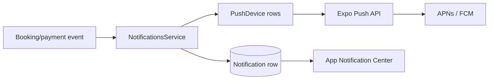

# Y&T Paws Platform — Notification Design

**Version:** 1.3
**Updated:** 2026-08-10
**Status:** In-app notifications implemented; remote push implemented but awaits EAS physical-device verification.

## 1. Scope

V1 uses a durable in-app Notification Center plus best-effort Expo push. The database row is authoritative; remote delivery is an optional attention signal and may fail without changing the originating booking/payment operation.

Email is not part of the notification center. Resend currently serves password-reset delivery. Operational alerts are also separate and target maintainers rather than customers.

## 2. Architecture

`NotificationsService.notify()` first creates the database row, then starts push delivery without awaiting it. A push timeout, invalid token or Expo outage therefore cannot roll back a booking or payment update.

## 3. Events

Implemented producers include:

- booking status changes and cancellation → customer;
- Stripe payment success/failure → customer;
- WeChat “I've paid” → customer acknowledgement and business-manager action notification;
- WeChat verification → customer;
- refund completion → customer;
- cross-method double payment → owner/admin manual-refund warning.

There is no public create-notification endpoint. Business events create notifications through backend services, preventing clients from impersonating the system.

## 4. Data and API

`Notification` stores `id`, `userId`, title, body, optional `readAt` and `createdAt`. Endpoints are:

- `GET /notifications/mine`
- `PATCH /notifications/:id/read`
- `PATCH /notifications/register-device`
- `PATCH /notifications/unregister-device`

All require JWT. Mark-read verifies ownership. Registration upserts one `PushDevice` row per Expo token; logout removes only that device token. `PushTicket` stores Expo ticket and reconciliation state.

## 5. App behavior

Home screens show an unread badge and open `NotificationsScreen`. Items are newest-first and can be marked read. The App requests permission and registers an Expo token only in a supported native build. Denial or unsupported Expo Go behavior must not block core use.

The account stores `locale` (`en` or `zh`). Language changes sync through `PATCH /auth/locale`; the server selects one language before writing the in-app row and sending push.

## 6. Push credentials and deep links

Remote push requires an EAS project UUID, an EAS/dev-client or production build, APNs credentials for iOS and FCM configuration for Android. It cannot be considered verified from Expo Go.

V1 push payloads contain title/body only and open the App normally. Booking/payment deep-link routing from push is deferred; when added, payload data must use allow-listed route names and server-authorized IDs rather than arbitrary URLs.

## 7. Reliability and privacy

- In-app row creation is awaited and is the product guarantee.
- Push is fire-and-forget with a five-second network abort.
- Push bodies should remain minimal and avoid pet health details, payment provider references or other sensitive data on lock screens.
- A stale token must never fail the business transaction.
- Account deletion removes notifications and push tokens.

Expo ticket IDs are persisted. A background reconciler polls receipts, removes `DeviceNotRegistered` tokens, retries transient receipt errors with exponential backoff and marks terminal failures after four attempts. Physical-device delivery and provider metrics still require provisioned EAS credentials.

## 8. Monitoring and tests

Current E2E verifies notification creation, ownership and mark-read behavior. Physical-device tests must cover foreground/background/terminated delivery, permission denied, token refresh, logout/unregister and both iOS/Android.

Production metrics should track durable rows, push attempts, accepted tickets, receipt failures, invalid tokens and delivery latency. Do not log full notification bodies when they may contain booking context.

## 9. Deferred

User notification preferences, quiet hours, bulk campaigns, scheduled reminders, push deep-link routing and provider-guaranteed delivery are outside V1. Multiple devices and per-recipient single-language payloads are implemented.

## Change Log

| Date | Version | Change |
|---|---|---|
| 2026-08-07 | 1.0 | Documented durable in-app notifications, best-effort Expo push, event producers, permissions, credentials and known V1 limits. |
| 2026-08-08 | 1.1 | Added multi-device token storage/targeted unregister and bilingual system-event payloads; retained physical-device delivery as a release evidence gate. |
| 2026-08-09 | 1.2 | Persisted Expo tickets and added receipt polling, invalid-token removal, exponential retry and terminal failure tracking. |
| 2026-08-10 | 1.3 | Persisted account locale and selected one recipient language before durable notification and push delivery. |
