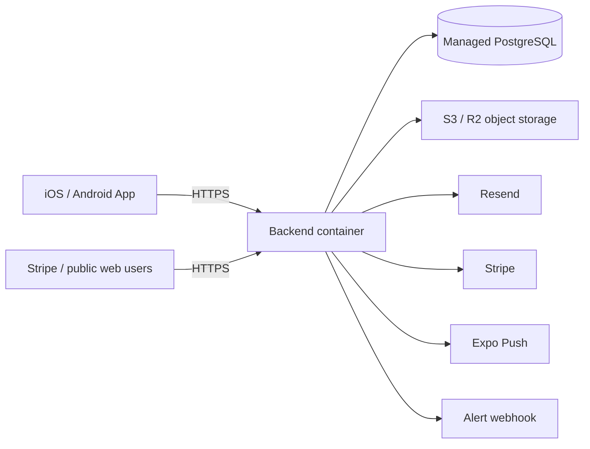

# Y&T Paws Platform — Deployment

**Version:** 1.1
**Updated:** 2026-08-08
**Status:** Deployment code baseline implemented; hosting, domains and production credentials are not yet provisioned.

## 1. Target topology

Recommended low-operations setup: Cloudflare DNS, Railway or Render container hosting, managed PostgreSQL, Cloudflare R2 or S3, Resend and Stripe. Equivalent providers are acceptable if HTTPS, secrets, backups and health probes are supported.

## 2. Environments

| Environment | Purpose | Data/providers |
|---|---|---|
| Local | Development | Local PostgreSQL, test/mock provider keys. |
| Preview/Staging | EAS preview and real-device regression | Separate managed DB/bucket, Stripe test mode, verified test email domain. |
| Production | Store release | Dedicated DB/bucket, live Stripe, production email/push and monitored alerts. |

Never share databases, buckets, Stripe mode or secrets between staging and production. `eas.json` currently contains placeholder staging/production domains and must be updated after hosting is provisioned. The EAS pre-install hook rejects preview/production builds while either public URL is missing, malformed, non-HTTPS or still a placeholder.

## 3. Backend container

The multi-stage Node 22 Dockerfile installs/builds dependencies, generates Prisma Client, copies only runtime artifacts, runs as the non-root `node` user, exposes platform `PORT`, and defines a readiness health check.

`docker-entrypoint.sh` executes `prisma migrate deploy` before `node dist/src/main.js`. Nest enables shutdown hooks; `PrismaService` closes its PostgreSQL adapter pool during termination. Hosting must provide enough shutdown grace for in-flight HTTP requests and database cleanup.

## 4. Health and rollout

- `/health/live`: process is running.
- `/health/ready`: performs a real `SELECT 1` against PostgreSQL.
- Container `HEALTHCHECK` targets readiness.

Use readiness for traffic admission and deployment success. A failed migration must stop startup; do not route traffic to an instance that has not completed migrations. For a single-instance V1 deployment, schedule a maintenance window for destructive/long-running migrations. Later adopt backward-compatible expand/migrate/contract releases.

## 5. Required production configuration

The backend fails fast when required values are missing or unsafe:

- database/JWT: `DATABASE_URL`, strong `JWT_SECRET`;
- public network: `PUBLIC_WEB_URL`, `SUPPORT_EMAIL`, explicit HTTPS `CORS_ORIGINS`;
- email: `RESEND_API_KEY`, `MAIL_FROM`;
- payment: live `STRIPE_SECRET_KEY`, `STRIPE_WEBHOOK_SECRET`;
- media: bucket, public URL and access credentials, plus endpoint/region where needed;
- operations: HTTPS `ALERT_WEBHOOK_URL`;
- platform: `NODE_ENV=production`, optional platform `PORT`.

`EXPOSE_PASSWORD_RESET_TOKEN` must be false. Secrets belong in the hosting secret manager, never Git, EAS public variables or the mobile bundle.

## 6. Database deployment and backup

Use managed PostgreSQL with private networking or enforced TLS, automated daily backups, point-in-time recovery if available and retention matching business/legal needs. Test restoration before launch and periodically thereafter.

Only committed migrations run in production. Use `prisma migrate deploy`, never `db push`. Review generated migrations because hand-written partial payment indexes are not representable in the Prisma DSL. Back up before risky changes and verify `/health/ready` plus critical queries after migration.

## 7. Object storage

Create separate staging/production buckets and least-privilege credentials. Configure CORS for the App's presigned PUT flow, HTTPS public/custom domain, content-type/size policy and lifecycle deletion. Migrate legacy base64 media before public rollout with the supplied migration command, then verify URLs and database size.

## 8. External integrations

- Resend: verify sending domain, configure SPF/DKIM and production sender.
- Stripe: verified merchant, live key, HTTPS webhook endpoint and required Checkout/refund events.
- Expo: EAS project UUID, APNs and FCM credentials; physical-device validation.
- Alert webhook: monitored Slack/Teams/incident receiver with restricted access.

## 9. Mobile delivery

Set real `EXPO_PUBLIC_API_URL` and `EXPO_PUBLIC_WEB_URL` for preview and production before building. Configure EAS project ID, Apple/Google credentials, bundle/package ownership, native permissions, icons/splash and store metadata.

Pipeline: deploy staging backend → apply migrations → preview EAS build → physical-device regression → deploy production backend → production EAS build → store submission. A mobile release must stay compatible with the deployed API while older store versions remain installed.

## 10. CI/CD

GitHub Actions currently installs locked dependencies, generates Prisma Client, migrates an isolated PostgreSQL service, builds/tests backend, builds the production Docker image, type-checks the App, runs App policy/configuration tests and rejects known core-document/configuration drift.

CI does not currently deploy automatically. Initial production deployment should use an approved manual promotion from a passing commit. Add environment protection, immutable image tags, deployment logs and rollback procedures before enabling automatic production releases.

## 11. Monitoring and rollback

At minimum monitor availability/readiness, error rate, latency, DB connections/storage/backup age, Stripe webhook failures, stale refunds, email failures and object-storage errors. Current webhook alerts cover the highest-risk payment/email paths; centralized logs, metrics and error tracing still require a real provider.

Rollback the container to the previous immutable image only when its code is compatible with the migrated schema. Database rollback is restore/forward-fix, not an unreviewed reverse migration. Preserve payment webhooks during incidents and reconcile events after recovery.

## 12. Provisioning checklist

- Production/staging domains and DNS.
- Hosting project and managed PostgreSQL URLs.
- Backup and restore test.
- Resend domain/key/sender.
- R2/S3 bucket, keys, public domain and CORS.
- Stripe test/live keys, webhook endpoints and merchant verification.
- Alert receiver.
- EAS UUID, Apple and Google credentials.
- Replace every EAS placeholder and run preview/production smoke tests.

## Change Log

| Date | Version | Change |
|---|---|---|
| 2026-08-07 | 1.0 | Documented the implemented container/migration/health/CI baseline and the remaining production provisioning, release and rollback process. |
| 2026-08-08 | 1.1 | Added fail-fast EAS release URL validation and CI checks for App policies plus core-document/configuration drift. |
